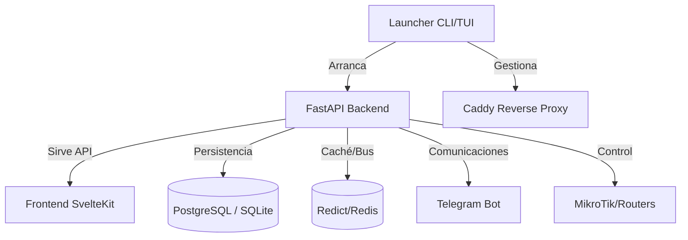

# 🗺️ Mapa para Desarrolladores: OmniWISP

Este documento sirve como guía técnica para navegar y entender la arquitectura de **OmniWISP**.

## 🏗️ Resumen Arquitectónico

OmniWISP utiliza una arquitectura de tres capas principales coordinadas por un lanzador central:

## 📂 Estructura del Proyecto

- **`/app`**: El núcleo del backend (FastAPI).
  - `/models`: Definiciones de tablas (SQLModel).
  - `/schemas`: Modelos de Pydantic para la API.
  - `/api`: Endpoints divididos por versión y módulo.
  - `/db`: Configuración de la base de datos y migraciones.
  - `/services`: Lógica de negocio (interacción con MikroTik, cálculos, etc.).
- **`/launcher`**: Código del comando `omniwisp`.
  - `/tui`: Interfaz gráfica de terminal (Textual).
  - `/commands`: Lógica de `setup`, `diagnose`, `manage`.
- **`/frontend-v2-daisy`**: La aplicación web moderna (SvelteKit + DaisyUI).
- **`/data`**: Almacenamiento local (logs, archivos temporales, base de datos SQLite si aplica).

## 🛠️ Estándares Técnicos

1.  **Backend**: Seguir **PEP 8**. Usar `SQLModel` para modelos que son tanto de DB como de API.
2.  **API**: Documentación automática en `http://localhost:7777/docs`.
3.  **Frontend**: Componentes reutilizables en Svelte. Estilizado con **TailwindCSS** y **DaisyUI**.
4.  **Configuración**: Centralizada en `.env`. Se accede mediante `app/core/config.py`.

## 📍 Puntos de Entrada
- **Lanzador**: `launcher/main.py:main`
- **Backend API**: `app/main.py`
- **Frontend**: `frontend-v2-daisy/src/app.html`
