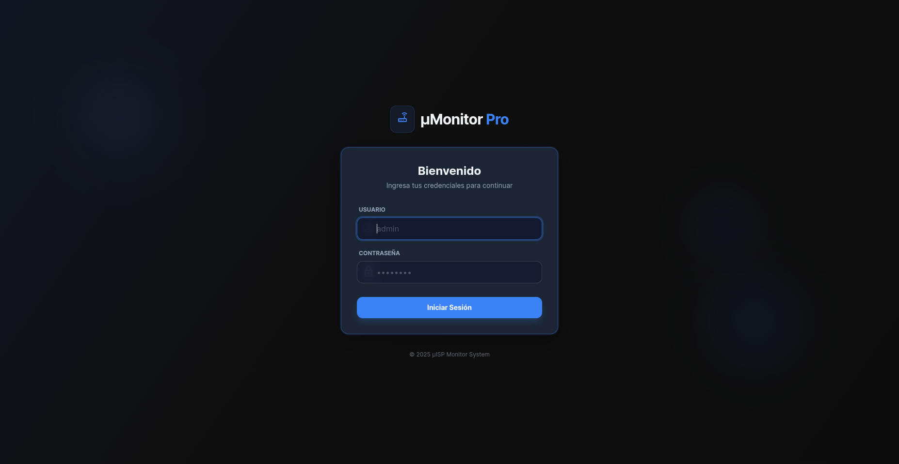

# µMonitor Pro

µMonitor Pro es una solución avanzada para la gestión y monitoreo de redes ISP/WISP. Este sistema permite administrar dispositivos, zonas, clientes y cortes de servicio de manera eficiente.



## ✨ Funcionalidades Principales

### 📡 Gestión de Red (MikroTik)

- **Control de Servicio**:
  - Corte y suspensión automática para **PPPoE** y **Simple Queues**.
  - Reducción de velocidad a 1k (Drop) o corte total mediante Address List.
  - Deshabilitación de Secrets en PPPoE.
- **Planes de Internet**: Creación y gestión de planes para PPPoE y Queues simples.

### 💰 Facturación y Pagos

- **Gestión de Pagos**: Registro de pagos mensuales y opción de **adelantar pagos**.
- **Impresión de Tickets**: Generación de recibos con datos personalizables desde la configuración (Settings).

### 🛠 Infraestructura

- **Multi-Marca**: Soporte para dispositivos **MikroTik** (Routers/Switches) y Puntos de Acceso **Ubiquiti / MikroTik**.
- **Gestión de Zonas**: Organización lógica de la red por nodos o torres.

## 📋 Requisitos Previos

Antes de comenzar, asegúrate de tener instalado lo siguiente:

- **Python 3.10+**: Lenguaje base del backend.
- **Git**: Para clonar el repositorio (Opcional si descargas el ZIP).

### 🖥️ Compatibilidad y Soporte

Actualmente, el sistema está optimizado para funcionar nativamente en **Linux**.

- **Soporte Completo**: Servidores Linux (Ubuntu/Debian), Mini PCs, SBCs ARM64 (Raspberry Pi 4/5, Orange Pi), y dispositivos con Armbian (TV Box).
- **Windows**: El soporte nativo completo se ha **perdido temporalmente**. Estamos trabajando para restaurar la compatibilidad al 100% y evitar el uso de Docker o Máquinas Virtuales.

## 🚀 Instalación y Configuración

Sigue estos pasos para poner en marcha el proyecto en tu entorno local.

### 1. Obtener el código

Puedes descargar el código de dos formas:

#### Opción A: Clonar con Git (Recomendado)

```bash
git clone <url-del-repositorio>
cd umanager6
```

#### Opción B: Descargar ZIP

Si no deseas usar la terminal, descarga el archivo ZIP desde GitHub, descomprímelo y abre la carpeta resultante.

### 2. Crear y Activar el Entorno Virtual (venv)

Es altamente recomendable usar un entorno virtual para aislar las dependencias del proyecto.

```bash
# Crear el entorno virtual
python3 -m venv .venv

# Activar el entorno virtual
# En Linux/macOS:
source .venv/bin/activate

# En Windows:
# .venv\Scripts\activate
```

### 3. Instalar Dependencias del Backend

Con el entorno virtual activo, instala las librerías necesarias:

```bash
pip install -r requirements.txt
```

### 4. Configuración Inicial (.env)

El sistema incluye un script de lanzamiento (`launcher.py`) que te guiará en la configuración inicial si no existe el archivo `.env`.

Puedes ejecutarlo directamente:

```bash
python launcher.py
```

Este asistente te preguntará:

- Puerto de ejecución (Default: 7777).
- Si deseas habilitar HTTPS (requiere configuración adicional).
- Creación de un usuario **Administrador** (si la base de datos es nueva).

## ▶️ Ejecución de la Aplicación

Una vez configurado, puedes iniciar la aplicación de dos formas:

### Opción A: Usando el Launcher (Recomendado)

```bash
python launcher.py
```

Este script se encargará de levantar el servidor API y el Scheduler de tareas en segundo plano.

### Opción B: Usando Uvicorn directamente

Si prefieres ejecutar solo el servidor web (útil para desarrollo):

```bash
python -m uvicorn app.main:app --reload --host 0.0.0.0 --port 7777
```

*(Asegúrate de cambiar el puerto si configuraste uno diferente en tu .env)*

## 💡 Uso Básico

1. Abre tu navegador y ve a `http://localhost:7777` (o el puerto que hayas configurado).
2. Inicia sesión con las credenciales de administrador que creaste durante la configuración.

### ⚠️ Requisito Importante: Gestión de Zonas

Para poder agregar dispositivos (Routers, Puntos de Acceso (ubiquiti y microtik), Switches) al sistema, **es obligatorio crear primero una Zona**.

1. Ve al menú **Infraestructura** > **Zonas**.
2. Haz clic en **"Nueva Zona"**.
3. Asigna un nombre (ej. "Nodo Central", "Torre Norte") y guarda.

**Nota:** Sin una zona creada, el sistema no te permitirá registrar ningún dispositivo de red, ya que todos los equipos deben estar asociados geográficamente o lógicamente a una zona.

## 🛠 Comandos Útiles

- **Verificar estado**: `curl -I http://localhost:7777`

## 👨‍💻 Guía para Desarrolladores

Si deseas contribuir al proyecto o modificarlo para tus necesidades, ten en cuenta lo siguiente:

### Licencia y Forking

Este proyecto se distribuye bajo la licencia **AGPL v3**.
> **Recomendación:** Se sugiere realizar un **Fork** del repositorio para trabajar en tus propias modificaciones sin detener el desarrollo de la aplicación principal.

### Desarrollo Frontend

El proyecto utiliza TailwindCSS para los estilos. Si necesitas modificar el diseño:

1. **Instalar dependencias**:

   ```bash
   npm install
   ```

2. **Compilar CSS**:

   ```bash
   # Compilación única
   npm run build:css

   # Modo escucha (Watch) durante el desarrollo
   npm run watch:css
   ```

---
Desarrollado con ❤️ para WISPs.
