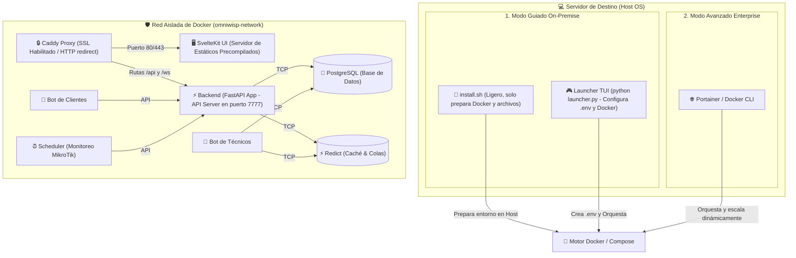

# 🐳 Plan Maestro de Dockerización y Consolidación de Infraestructura: OmniWISP Pro

Este plan estratégico establece el diseño técnico, la arquitectura de distribución y un **roadmap paso a paso** para llevar a cabo la dockerización completa de OmniWISP Pro. 

El objetivo principal es limpiar la base de código de la aplicación de tareas de infraestructura (evitando errores y problemas de seguridad) y habilitar dos canales de despliegue claramente diferenciados para nuestros usuarios:
1. **Despliegue On-Premise/TUI (Guiado)**: Para servidores locales o VPS administrados por la consola interactiva `launcher.py` en el host, la cual se encarga de la configuración del `.env` y control de Docker de manera 100% visual y guiada.
2. **Despliegue DevOps Enterprise (Headless)**: Para despliegues en la nube, stacks de **Portainer**, Kubernetes o Docker Compose nativo, prescindiendo por completo del Launcher y optimizando los recursos del sistema host al 100%.

---

## 📐 1. Arquitectura de Despliegue Dual

El sistema se divide en contenedores desacoplados y precompilados por el desarrollador. La orquestación se realiza de forma declarativa desde fuera de la aplicación.



---

## 🛠️ 2. Flujo de los Canales de Despliegue

### A. Canal Avanzado Enterprise (Portainer / Docker CLI)
El administrador del WISP despliega OmniWISP Pro en su servidor en la nube sin usar terminales de Python ni asistentes locales.

1. **Stack de Portainer**: El usuario crea un nuevo Stack en su panel de Portainer y pega el código del `docker-compose.yml` oficial.
2. **Environment**: Configura las variables de entorno (`DATABASE_URL`, `REDICT_URL`, `SECRET_KEY`, `ENCRYPTION_KEY`) en el formulario visual de Portainer.
3. **Despliegue**: Presiona "Deploy the Stack". Docker descarga directamente las imágenes precompiladas de los contenedores de la suite y arranca la aplicación de manera limpia e instantánea.
4. **Administración**: Usa los gráficos nativos de Portainer para ver consumo de recursos, reiniciar contenedores o consultar logs, sin requerir `launcher.py` ni instalación de Python en el host.

---

### B. Canal Guiado On-Premise (Host Linux + Launcher TUI)
El enfoque definitivo para técnicos de WISP locales que quieren instalar OmniWISP Pro en su propio hardware o VPS de forma guiada y visual:

1. **El Script de Instalación (`install.sh`) es 100% silencioso y rápido**:
   * Su único objetivo es comprobar que Docker y Docker Compose estén instalados en el host.
   * Descarga la estructura del proyecto y prepara los directorios del host.
   * Instala los requerimientos básicos del Launcher en el entorno virtual (`.venv`) del host.
   * **No hace preguntas interactivas ni solicita datos**, evitando errores en scripts Bash largos.
2. **El Launcher TUI (`launcher.py`) toma el control total de la Configuración**:
   * Al ejecutarse por primera vez (`python launcher.py`), detecta que el archivo `.env` está vacío y lanza automáticamente el **Asistente de Configuración (Setup Wizard)** en su hermosa interfaz gráfica de terminal.
   * Genera de forma segura llaves criptográficas únicas (`SECRET_KEY`, `ENCRYPTION_KEY`).
   * Permite configurar los parámetros del host (puertos, dominio) y la elección de base de datos (local o remota).
   * **Administración del `.env`**: El usuario puede entrar en cualquier momento a una sección de "Configuración" en la TUI para editar variables, cambiar credenciales de bases de datos o renovar claves de manera visual y segura, sin tener que abrir editores de texto como Nano o Vim.
   * **Lanzamiento de Docker**: Tras finalizar la configuración en la TUI, el Launcher ejecuta de forma invisible `docker compose up -d` y arranca los servicios.

---

## 📅 3. Roadmap Detallado por Fases (Paso a Paso)

La migración se dividirá en **4 fases iterativas** para asegurar un desarrollo seguro sin interrumpir el funcionamiento actual del sistema:

```
 ┌──────────────────────┐      ┌──────────────────────┐      ┌──────────────────────┐      ┌──────────────────────┐
 │  FASE 1: LIMPIEZA &  │      │   FASE 2: DOCKERFILES │      │  FASE 3: INSTALADOR  │      │ FASE 4: MIGRACIÓN    │
 │   PREPARACIÓN API    │ ───> │    PRECOMPILADOS     │ ───> │     Y CADDYFILE      │ ───> │  DE LA CONFIGURACIÓN │
 └──────────────────────┘      └──────────────────────┘      └──────────────────────┘      └──────────────────────┘
```

---

### FASE 1: Limpieza del Backend y Preparación de la API
*El objetivo de esta fase es remover todo el código que lanza o administra contenedores e infraestructura desde el backend en Python para evitar bugs y riesgos de seguridad.*

- [ ] **Remoción de Procesos**: Analizar y limpiar las clases del backend que levanten subprocesos relacionados con la infraestructura.
- [ ] **Manejo de Errores de Conexión**: Modificar la inicialización del pool de base de datos en FastAPI (`app/core/db.py` o similar). Si la base de datos local o remota no está en línea al arrancar, el backend debe intentar reconectarse en bucle asíncrono (ej. reintentar cada 5 segundos hasta 10 veces) en lugar de crashear el contenedor de inmediato.
- [ ] **Middleware de Bienvenida**: Crear un middleware básico que detecte si el servidor web no tiene cuentas de administrador y, en tal caso, redirija visualmente a la ruta `/setup` de la interfaz para crear el primer usuario de forma segura.

---

### FASE 2: Creación de Dockerfiles Precompilados (Flujo de Release)
*El objetivo es preparar los contenedores independientes para que el servidor de destino reciba binarios/estáticos compilados previamente, optimizando recursos.*

- [ ] **Dockerfile.frontend (Servidor Estático)**:
  * Crear un `Dockerfile.frontend` en la raíz de `frontend-v2-daisy/`.
  * Configurar para que tome la carpeta `build/` compilada localmente con `pnpm build` y la exponga en una imagen ligera de Caddy o Nginx en el puerto `3000`.
- [ ] **Dockerfile.backend (FastAPI + Bots + Scheduler)**:
  * Diseñar la imagen de backend basada en `python:3.10-slim-buster`.
  * Instalar dependencias necesarias para compilar paquetes de criptografía en Python.
  * Copiar la lógica del backend, el programador y los bots de Telegram.
- [ ] **Script de Build del Programador (`scripts/build_release.sh`)**:
  * Crear un script en Bash para tu uso en desarrollo que automatice la compilación:
    ```bash
    #!/bin/bash
    echo "⚙️ Compilando Frontend..."
    cd frontend-v2-daisy && pnpm build && cd ..
    echo "🐳 Compilando imágenes Docker..."
    docker build -t tu-usuario/omniwisp-frontend:latest -f frontend-v2-daisy/Dockerfile.frontend ./frontend-v2-daisy
    docker build -t tu-usuario/omniwisp-backend:latest -f Dockerfile.backend .
    ```

---

### FASE 3: Desarrollo del Script de Instalación (`install.sh`) y Orquestación
*El objetivo es dotar al host de un instalador ágil, universal y sin pantallas interactivas complejas.*

- [ ] **Diseño del Caddyfile de Docker**:
  * Crear un `Caddyfile` optimizado para producciones Dockerizado que redirija tráfico web general a `frontend:3000` y tráfico de API/WebSockets a `backend:7777`.
- [ ] **Desarrollo de `install.sh`**:
  * Escribir un script ágil y no interactivo en Bash para el host de Linux.
  * Implementar verificación automática de requisitos previos (instalar Docker/Compose si es necesario).
  * Preparar las carpetas del host para base de datos y logs.
  * Configurar e inicializar el entorno virtual `.venv` en el host e instalar dependencias del Launcher.
  * Invocar al final al `launcher.py` interactivo.

---

### FASE 4: Migración de la Configuración y Adaptación del Launcher TUI
*El objetivo es consolidar el Launcher TUI como el administrador visual definitivo de Docker y de las variables del `.env`.*

- [ ] **Asistente de Configuración (Setup Wizard) TUI**:
  * Crear o adaptar la interfaz del setup en `launcher/setup_wizard.py` para ejecutarse en la TUI de Textual.
  * Diseñar formularios visuales en la consola para elegir entre base de datos local y remota, e ingresar credenciales de forma interactiva.
  * Escribir y validar el archivo `.env` en el host con claves seguras autogeneradas.
- [ ] **Editor Visual del `.env`**:
  * Añadir un panel de "Configuración del Servidor" en el menú de la TUI.
  * Permitir que el usuario pueda visualizar los valores actuales del `.env` y editarlos (ej. modificar el puerto, cambiar credenciales de bots) desde la interfaz visual sin salir de la TUI.
- [ ] **Control e Integración de Docker en la TUI**:
  * Modificar `launcher/services.py` para que, tras guardar la configuración, ejecute `docker compose up -d` en el host.
  * Canalizar la lectura de logs de los contenedores (`docker compose logs -f backend`) directamente hacia el widget de logs de la TUI.
  * Mapear las estadísticas de CPU y memoria de los contenedores a los widgets gráficos de la terminal en tiempo real.
  * Agregar botón para respaldos rápidos de base de datos relacional de Postgres desde el contenedor a una carpeta de backups local.

---

## 🔒 4. Consideraciones de Seguridad y Robustez

1. **Sin Exposición Externa Innecesaria**:
   Tanto PostgreSQL, Redict, el Backend y el Frontend **no exponen puertos directamente al exterior** en el `docker-compose.yml`. Únicamente **Caddy** expone sus puertos `80` y `443` al mundo de manera directa. Toda la comunicación cruzada fluye dentro de la red interna de Docker, blindando la base de datos contra intrusiones.
2. **Volúmenes Persistentes**:
   Los datos de la base de datos relacional (`postgres_data`) y de la caché (`redict_data`) se almacenan en volúmenes lógicos persistentes de Docker. Al actualizar contenedores o reiniciar el servidor, la base de datos e inventarios permanecen intactos.
3. **Manejo Inteligente de Variables**:
   Las contraseñas de las bases de datos locales no se guardan directamente en el código; la TUI del Launcher genera cadenas robustas y las escribe dinámicamente en el archivo `.env` local del cliente.

---

> 🚀 **Meta Final**: Con este roadmap completado, OmniWISP Pro tendrá un estándar de despliegue insuperable: los usuarios avanzados tendrán un stack Docker modular que se despliega en Portainer en segundos, mientras que los administradores locales tendrán en su host la herramienta de terminal más potente, visual y cómoda del mercado para configurar sus variables `.env` y gestionar sus contenedores Docker.
