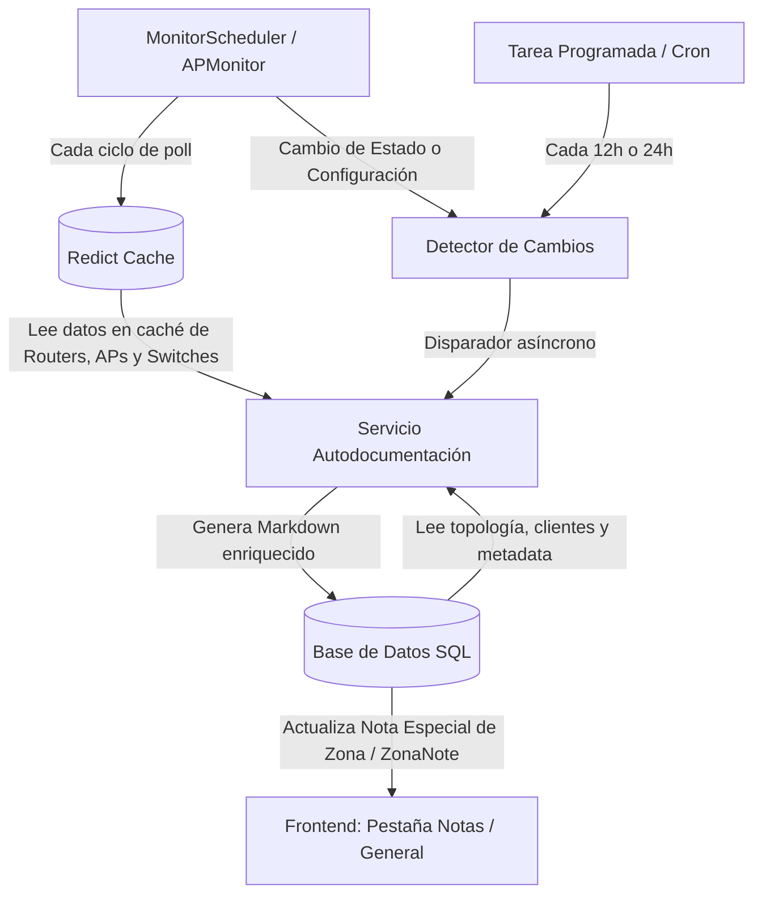

# 🔌 Plan de Autodocumentación de PoP en Base a Caché (Redict)

Este documento describe la arquitectura, el diseño de base de datos y la estrategia de actualización asíncrona para implementar la autodocumentación automática de cada **PoP (Point of Presence / Zona)** en OmniWISP de manera ultra-eficiente.

---

## 🎯 1. Filosofía del Sistema: Cero Desperdicio de Recursos

En un entorno de red de proveedor de internet (WISP), **la telemetría en vivo bajo demanda es costosa**. Realizar consultas directas por API a los routers de borde (MikroTik) o a los Access Points (Ubiquiti/MikroTik) cada vez que un usuario accede al frontend:
1. Satura el procesador de los routers del cliente.
2. Introduce latencias innecesarias de 2 a 5 segundos en la interfaz web.
3. Genera vulnerabilidad a caídas si un enlace está inestable.

**La Solución:** 
Generar fichas de red y diagramas de topología de manera **asíncrona y reactiva**, consumiendo únicamente los datos locales que el monitor ya está recolectando periódicamente en **Redict (Redis)** y en la base de datos local.

---

## 🏗️ 2. Arquitectura de Datos e Integración

El motor de autodocumentación cruzará tres fuentes de información local:
1. **Base de Datos Relacional (SQLModel):** Estructura del PoP (Router principal, APs sectoriales asociados, Switches y Clientes asignados a la zona).
2. **Caché en Redict (Stores de Telemetría):** Stores existentes como `router_stats`, `ap_stats` y `switch_stats` que contienen el último estado de hardware conocido (CPU, memoria, versión, uptime, temperatura, voltaje, etc.).
3. **Control de Cambios (Redict):** Un store especial `autodoc_hash` que almacenará el hash MD5/SHA256 del último reporte generado para cada zona, permitiendo omitir escrituras innecesarias en la base de datos.



---

## ⚡ 3. Estrategia de Disparadores (Triggers)

Para mantener la ficha técnica del PoP actualizada de manera inteligente, se implementan tres tipos de disparadores:

### A. Disparador por Cambio de Configuración (Reactivo)
Cada vez que el `MonitorScheduler` o `APMonitorScheduler` complete su ciclo de verificación:
* Se calcula un hash de la telemetría del hardware y de las interfaces en caché.
* Si el nuevo hash es diferente al anterior guardado en `autodoc_hash`, significa que el router o AP sufrió una modificación física o lógica (ej. actualización de RouterOS, cambio de SSID, cambio de canales, o interfaces que subieron/bajaron).
* Se regenera el documento automáticamente de inmediato.

### B. Disparador por Estado Crítico (Emergencias)
Si un equipo crítico del PoP cambia de estado (ej. de `ONLINE` a `OFFLINE`), se fuerza la reconstrucción instantánea del reporte para alertar al técnico en la interfaz y registrar las horas exactas del incidente.

### C. Disparador Periódico (Consolidación / Cron)
Una tarea en segundo plano programada cada cierto tiempo (ej. cada 12 o 24 horas):
* Actualiza métricas de comportamiento lento: clientes totales asignados a la zona, sesiones PPPoE simultáneas en el día, consumo de tráfico WAN histórico de subida/bajada y fechas de próximo mantenimiento.

---

## 💾 4. Almacenamiento y Renderizado (Cero Cambios de Frontend)

Para evitar reescribir código del frontend (SvelteKit + DaisyUI) o alterar APIs de visualización, aprovecharemos el motor de notas existente:
* El informe de autodocumentación se guardará en la tabla `zona_notes` (`ZonaNote`) como una nota especial con el título reservado: `🔌 [AUTODOC] Ficha Técnica del PoP`.
* Dado que el frontend de OmniWISP ya soporta renderizar y listar las notas asociadas a cada zona mediante la pestaña **Notas**, los técnicos tendrán acceso a la ficha autodocumentada en tiempo real de forma nativa.

---

## 🛠️ 5. Propuesta de Implementación del Backend

Se propone la creación de un nuevo servicio `app/services/network/zone_autodoc_service.py` con la siguiente estructura y lógica:

```python
# app/services/network/zone_autodoc_service.py
"""
ZoneAutodocService: Servicio encargado de compilar la telemetría local de Redict
y generar el informe Markdown autodocumentado del PoP.
"""

import json
import hashlib
from datetime import datetime
from sqlmodel import Session, select
from ...utils.cache import cache_manager
from ...models.zona import Zona, ZonaNote
from ...models.router import Router
from ...models.ap import AP
from ...models.client import Client

class ZoneAutodocService:
    def __init__(self, session: Session):
        self.session = session

    async def get_cached_pop_data(self, zona_id: int) -> dict:
        """
        Extrae la telemetría más reciente almacenada en Redict para todos 
        los equipos asociados al PoP sin tocar la red física.
        """
        router_cache = cache_manager.get_store("router_stats")
        ap_cache = cache_manager.get_store("ap_stats")
        
        # 1. Recuperar los routers, APs y clientes asignados de la DB
        routers = self.session.exec(select(Router).where(Router.zona_id == zona_id)).all()
        aps = self.session.exec(select(AP).where(AP.zona_id == zona_id)).all()
        clients_count = len(self.session.exec(select(Client).where(Client.zona_id == zona_id)).all())
        
        pop_data = {
            "routers": [],
            "aps": [],
            "clients_count": clients_count
        }
        
        # 2. Consultar caché local de Redict
        for r in routers:
            stats = await router_cache.get_async(r.host)
            pop_data["routers"].append({"meta": r, "stats": stats})
            
        for ap in aps:
            stats = await ap_cache.get_async(ap.host)
            pop_data["aps"].append({"meta": ap, "stats": stats})
            
        return pop_data

    async def generate_markdown_report(self, zona: Zona, pop_data: dict) -> str:
        """
        Construye la ficha técnica en formato Markdown utilizando tablas y bloques.
        """
        md = []
        md.append(f"# 🗺️ Ficha Técnica Autodocumentada: PoP {zona.nombre}")
        md.append(f"*Última actualización (Consolidación de Caché): {datetime.now().strftime('%Y-%m-%d %H:%M:%S')}*\n")
        
        # Resumen General de la Zona
        md.append("## 📊 Información General del Sitio")
        md.append(f"- **Dirección:** {zona.direccion or 'No especificada'}")
        md.append(f"- **Coordenadas GPS:** `{zona.coordenadas_gps or 'Sin configurar'}`")
        md.append(f"- **Clientes Conectados en esta Zona:** `{pop_data['clients_count']}`")
        
        if zona.infraestructura:
            infra = zona.infraestructura
            md.append("\n### 🔌 Infraestructura y Redes")
            md.append(f"- **IP de Gestión:** `{infra.direccion_ip_gestion or 'N/A'}`")
            md.append(f"- **Gateway:** `{infra.gateway_predeterminado or 'N/A'}`")
            md.append(f"- **VLANs Utilizadas:** `{infra.vlans_utilizadas or 'Ninguna'}`")
            md.append(f"- **Próximo Mantenimiento:** {infra.proximo_mantenimiento or 'No agendado'}")

        # Sección de Routers
        md.append("\n## 🖥️ Core Routers y Estado de Telemetría")
        for r in pop_data["routers"]:
            meta, stats = r["meta"], r["stats"]
            if not stats or "error" in stats:
                md.append(f"\n### ❌ Router: {meta.hostname or meta.host} (OFFLINE o Sin Datos en Caché)")
                md.append(f"- **IP de Acceso:** `{meta.host}`")
                continue
            
            md.append(f"\n### 🟢 Router: {stats.get('name', meta.host)}")
            md.append(f"- **Hardware/Placa:** {stats.get('board_name')} (Versión {stats.get('version')})")
            md.append(f"- **Uptime:** `{stats.get('uptime')}`")
            md.append(f"- **CPU:** {stats.get('cpu_load')}% | **RAM Libre:** {int(stats.get('free_memory', 0)) // 1024 // 1024} MB / {int(stats.get('total_memory', 0)) // 1024 // 1024} MB")
            
            # Datos de salud física
            voltage = stats.get("voltage")
            temp = stats.get("temperature") or stats.get("cpu_temperature")
            if voltage or temp:
                md.append(f"- **Salud Física:** {f'{voltage}V' if voltage else ''} {'|' if voltage and temp else ''} {f'{temp}°C' if temp else ''}")

        # Sección de Access Points
        md.append("\n## 🛰️ Sectores Activos (Access Points)")
        for ap in pop_data["aps"]:
            meta, stats = ap["meta"], ap["stats"]
            if not stats or "error" in stats:
                md.append(f"\n### ❌ AP Sectorial: {meta.host} (Sin Conexión)")
                continue
            
            md.append(f"\n### 📶 AP Sectorial: {stats.get('hostname', meta.host)}")
            md.append(f"- **SSID:** `{stats.get('ssid', 'N/A')}` | **Frecuencia:** `{stats.get('frequency', 'N/A')} MHz`")
            md.append(f"- **Dispositivo:** {stats.get('model')} (Firmware {stats.get('firmware')})")
            md.append(f"- **CPEs Conectados:** `{stats.get('cpes_count', 0)}` | **Ruido:** `{stats.get('noise_floor', 'N/A')} dBm`")
            
        return "\n".join(md)

    async def update_autodoc_note(self, zona_id: int) -> bool:
        """
        Genera el reporte y actualiza la nota de la zona si y solo si
        los datos han sufrido cambios significativos.
        """
        zona = self.session.get(Zona, zona_id)
        if not zona:
            return False
            
        pop_data = await self.get_cached_pop_data(zona_id)
        
        # Serializar y calcular hash para comparar cambios
        # Excluimos timestamps volátiles para evitar falsos positivos
        clean_pop_data = json.loads(json.dumps(pop_data, default=str))
        for r in clean_pop_data.get("routers", []):
            if r.get("stats"):
                r["stats"].pop("timestamp", None)
                r["stats"].pop("uptime", None)  # El uptime cambia constantemente, no es un cambio de configuración
                
        data_hash = hashlib.md5(json.dumps(clean_pop_data, sort_keys=True).encode()).hexdigest()
        
        # Comparar con caché de control
        hash_store = cache_manager.get_store("autodoc_hash")
        old_hash = await hash_store.get_async(str(zona_id))
        
        if old_hash == data_hash:
            return False  # Sin cambios reales detectados
            
        # Generar Markdown final
        report_md = await self.generate_markdown_report(zona, pop_data)
        
        # Buscar nota de autodoc existente o crearla
        note = self.session.exec(
            select(ZonaNote).where(
                ZonaNote.zona_id == zona_id,
                ZonaNote.title == "🔌 [AUTODOC] Ficha Técnica del PoP"
            )
        ).first()
        
        if note:
            note.content = report_md
            note.updated_at = datetime.utcnow()
        else:
            note = ZonaNote(
                zona_id=zona_id,
                title="🔌 [AUTODOC] Ficha Técnica del PoP",
                content=report_md,
                is_encrypted=False
            )
        
        self.session.add(note)
        self.session.commit()
        
        # Guardar el hash actual para el próximo ciclo
        await hash_store.set_async(str(zona_id), data_hash, ttl=86400)
        return True
```

---

## 📈 6. Ventajas del Enfoque Propuesto

1. **Cero Consumo de Ancho de Banda y Red:** La generación del documento es instantánea porque los datos de telemetría e infraestructura ya se extrajeron previamente por el monitor y se leyeron desde la memoria RAM (Redict).
2. **Previene Desgaste de Disco:** El uso de almacenamiento de hashes en Redict (`autodoc_hash`) garantiza que no se ejecuten sentencias `UPDATE` en PostgreSQL o SQLite si el estado del PoP sigue siendo idéntico.
3. **Integración Transparente:** La nota autodocumentada aparecerá en la interfaz web de inmediato dentro de la pestaña **Notas**, sin requerir modificaciones complejas ni despliegue de nuevos componentes en el frontend Svelte.
4. **Fácilmente Ampliable:** Puede extenderse para enviar PDFs semanales por correo electrónico o alertas detalladas a Telegram utilizando la misma lógica del servicio.

---

## 🔌 7. Visualización Simplificada de Puertos y VLANs (Reemplazo del SVG)

Anteriormente se intentó implementar una visualización interactiva basada en **renderizado de archivos SVG** y **consultas en tiempo real al dispositivo**. Dicho enfoque fue abandonado debido a su alta complejidad de desarrollo, fra### 7.1. Flujo de Datos Inteligente (Reutilización al 100% sin Consultas Redundantes)
Para alinearse con una filosofía de **cero desperdicio de recursos**, eliminamos cualquier consulta automatizada recurrente sobre puertos o VLANs en segundo plano. Dado que la distribución de cableado físico y las VLANs son datos **estructurales** (cambian muy rara vez en producción), no tiene sentido consultar las interfaces cada 5 o 10 minutos.

Aprovechamos al máximo lo que el sistema **ya hace de forma nativa**:

#### 1. Reutilización de la Telemetría Dinámica Existente
Métricas en vivo como el estado general del equipo (`ONLINE`/`OFFLINE`), uso de CPU, memoria, uptime, temperatura, voltajes y tráfico WAN **ya son leídos y guardados en caché constantemente** por el bucle principal de `MonitorScheduler` y `SwitchMonitorScheduler` en los stores `router_stats` y `switch_stats`. 
* El motor de autodocumentación (`ZoneAutodocService`) lee directamente de estos stores existentes. **No se añade ni una sola consulta de monitoreo extra.**

#### 2. Sincronización Estructural Única (Puertos y VLANs)
La estructura de puertos físicos y VLANs (mapeada por `get_device_infrastructure_data`) se tratará como información estructural estática. Se lee e inicializa únicamente en tres momentos clave:
* **Al registrar el dispositivo:** Cuando se agrega el router/switch en OmniWISP.
* **Al aprovisionar el dispositivo:** Durante el proceso de vinculación de seguridad.
* **Sincronización Manual Bajo Demanda:** Si el técnico realiza cambios físicos de cableado o reconfigura VLANs en el MikroTik, simplemente presiona un botón de **"🔄 Sincronizar Puertos"** en la pestaña de Infraestructura. Esto ejecuta una consulta única para refrescar la estructura almacenada en la base de datos/Redict de forma instantánea.

#### 3. Modificación de los Endpoints de Lectura
Los endpoints en [app/api/zonas/infra.py](file:///home/kaberromero/Documentos/proyectos/OmniWISP/app/api/zonas/infra.py) se modifican para ser de lectura instantánea local:
```python
# En app/api/zonas/infra.py
@router.get("/zonas/infra/router/{host}/ports")
async def get_router_ports_cached(host: str) -> dict[str, Any]:
    # 1. Recupera la estructura de puertos/VLANs guardada localmente en la base de datos
    device_structure = await get_stored_device_structure(host) 
    
    # 2. Cruza instantáneamente el estado UP/DOWN dinámico usando los datos que 
    # el monitor principal ya actualizó en el store "router_stats" de Redict
    stats_cache = cache_manager.get_store("router_stats")
    live_stats = await stats_cache.get_async(host)
    
    # Combinar estructura estática con estado dinámico en memoria y retornar
    return merge_structure_with_live_status(device_structure, live_stats)
```
Este enfoque garantiza **cero consultas adicionales recurrentes a los dispositivos**, logrando que la autodocumentación y la vista de puertos consuman exactamente **0% de CPU y red adicionales** en los MikroTik durante la operación regular.

4. **Consumo unificado:** El servicio de autodocumentación (`ZoneAutodocService`) consumirá la misma estructura local o en caché de Redict para generar la tabla Markdown automáticamente.

### 7.2. Interfaz de Usuario: Cuadrícula CSS Minimalista (Adiós SVG)
En lugar de dibujar un switch físico interactivo en SVG, el frontend en Svelte renderizará una **Cuadrícula CSS (CSS Grid)** utilizando componentes puros de DaisyUI/Tailwind.

* **Estructura Visual:** Una fila de pequeños bloques rectangulares que simulan el panel frontal del equipo (ej. bloques de 12 o 24 puertos).
  ```
  [ E1 ] [ E2 ] [ E3 ] [ E4 ]  -  [ SFP1 ] [ SFP2 ]
  (Verde)(Nara) (Gris) (Gris)      (Azul)  (Gris)
  ```
* **Estados de Color Basados en Datos de Caché:**
  * **Verde (link-ok + 1Gbps):** Enlace activo a máxima velocidad.
  * **Naranja/Amarillo (link-ok + 10/100Mbps):** Enlace activo pero limitado (alerta de posible cable dañado o puerto mal negociado).
  * **Gris (no-link o disabled):** Puerto libre o administrativamente apagado.
  * **Azul (SFP / Fibra):** Puertos de fibra óptica activos.
  * **Rojo (error / short-circuit):** Encontrado en puertos con PoE activo si hay un cortocircuito.

* **Detalles en Hover/Tooltips (CSS nativo):**
  Al pasar el cursor sobre cada puerto, se muestra un tooltip DaisyUI con:
  * **Nombre:** `ether1-WAN`
  * **Comentario:** `Enlace Fibra ISP` (extraído del comentario de MikroTik, ¡clave para autodocumentar!).
  * **Velocidad:** `1 Gbps (Full Duplex)`
  * **VLANs Asociadas:** `100 (Tagged), 200 (Untagged)`

### 7.3. Renderizado de Puertos en el Autodocumento (Markdown)
En el informe de autodocumentación generado en la nota, este estado se compilará automáticamente en una tabla Markdown clara y fácil de leer para el técnico en terreno:

| Puerto | Nombre / Rol | Estado | Velocidad | Comentario MikroTik | VLANs |
| :--- | :--- | :--- | :--- | :--- | :--- |
| **eth1** | ether1-WAN | 🟢 UP | 1 Gbps | Enlace Principal ISP | VLAN 100 |
| **eth2** | ether2-AP-Norte | 🟡 UP | 100 Mbps | Sectorial Norte (Cambiar cable!) | VLAN 10 (Access) |
| **eth3** | ether3-AP-Sur | 🟢 UP | 1000 Mbps | Sectorial Sur | VLAN 10 (Access) |
| **eth4** | ether4-Libre | ⚪ DOWN | — | Disponible | — |
| **sfp1** | sfp-sfpplus1 | 🔵 UP | 10 Gbps | Uplink al Switch Core | Trunk (Todas) |

### 7.4. Ejemplo de Código Svelte/Tailwind CSS Propuesto (Mockup Ilustrativo)
A continuación se describe la estructura minimalista propuesta para renderizar la cuadrícula de puertos utilizando componentes de utilidad estándar de Tailwind y DaisyUI en Svelte. Este diseño es 100% responsivo, no consume recursos gráficos y es extremadamente rápido de implementar.

```html
<script lang="ts">
  // Estructura simplificada que recibiría el frontend desde el caché de Redict
  export let ports = [
    { name: "ether1", role: "WAN", speed: "1 Gbps", status: "up", comment: "Enlace Fibra ISP", vlans: [100] },
    { name: "ether2", role: "AP-Norte", speed: "100 Mbps", status: "up", comment: "Sectorial Norte (Cambiar cable!)", vlans: [10] },
    { name: "ether3", role: "AP-Sur", speed: "1 Gbps", status: "up", comment: "Sectorial Sur", vlans: [10] },
    { name: "ether4", role: "Libre", speed: "—", status: "down", comment: "", vlans: [] },
    { name: "sfp-sfpplus1", role: "Uplink", speed: "10 Gbps", status: "up", comment: "Uplink Core", vlans: [10, 100] }
  ];

  // Helper para determinar clases Tailwind según el estado y velocidad
  function getPortClass(port: any) {
    if (port.status === "down") return "bg-gray-700 text-gray-400 border-gray-600";
    if (port.name.startsWith("sfp")) return "bg-blue-600 text-white border-blue-500 font-semibold";
    if (port.speed === "100 Mbps") return "bg-amber-500 text-slate-900 border-amber-400"; // Alerta Fast Ethernet
    return "bg-emerald-600 text-white border-emerald-500"; // Giga Ethernet UP
  }
</script>

<div class="p-4 bg-base-300 rounded-xl shadow-inner border border-base-200">
  <div class="flex items-center justify-between mb-3">
    <h4 class="text-sm font-bold opacity-80 uppercase tracking-wider">🔌 Estado de Puertos Físicos (Leído de Caché)</h4>
    <div class="flex gap-2 text-xs">
      <span class="flex items-center gap-1"><span class="w-2.5 h-2.5 rounded bg-emerald-600 inline-block"></span> 1 Gbps</span>
      <span class="flex items-center gap-1"><span class="w-2.5 h-2.5 rounded bg-amber-500 inline-block"></span> 100 Mbps</span>
      <span class="flex items-center gap-1"><span class="w-2.5 h-2.5 rounded bg-blue-600 inline-block"></span> SFP / Fibra</span>
      <span class="flex items-center gap-1"><span class="w-2.5 h-2.5 rounded bg-gray-700 inline-block"></span> Down</span>
    </div>
  </div>

  <!-- Contenedor CSS Grid Minimalista (DaisyUI Tooltip integrado) -->
  <div class="grid grid-cols-6 sm:grid-cols-12 gap-2 bg-base-100 p-4 rounded-lg border border-base-200">
    {#each ports as port}
      <div class="tooltip tooltip-bottom" data-tip="{port.name} - {port.role || 'Sin Rol'} ({port.speed}) {port.comment ? ' | ' + port.comment : ''}">
        <div class="flex flex-col items-center justify-center p-2 rounded border cursor-help text-xs transition-all hover:scale-105 {getPortClass(port)}">
          <span class="font-mono font-bold">{port.name.replace("ether", "E").replace("sfp-sfpplus", "SFP")}</span>
          <span class="text-[9px] opacity-75">{port.status === 'up' ? 'UP' : 'DOWN'}</span>
        </div>
      </div>
    {/each}
  </div>
</div>
```


