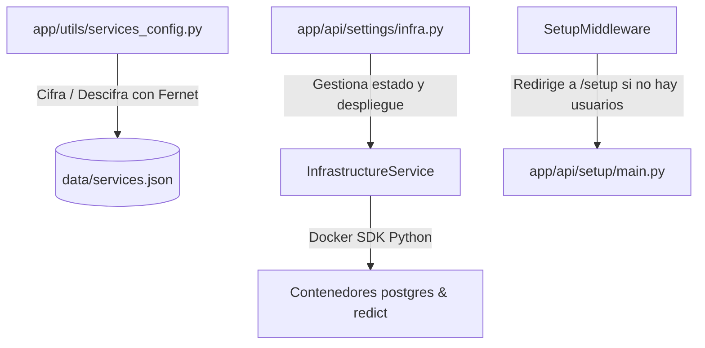

# Hoja de Ruta (Roadmap): Asistente de Instalación Web Multietapa (Setup Wizard)
Este documento detalla el plan fase por fase para implementar un asistente de instalación inicial web en **OmniWISP**. El objetivo es permitir a los usuarios configurar e iniciar su infraestructura de base de datos y caché (PostgreSQL, Redict en Docker) a través de una interfaz interactiva y segura antes de proceder a la creación del primer administrador.

---

## 📌 1. Visión y Objetivos

* **Facilidad de Uso (UX Premium):** Permitir a administradores o proveedores WISP instalar el sistema completo en su servidor con unos pocos clicks, sin necesidad de usar terminales SSH complicadas.
* **Seguridad desde el Origen:** Forzar la generación de contraseñas de alta seguridad en contenedores Docker y proteger los endpoints de configuración para que se autodestruyan/bloqueen permanentemente una vez creado el primer usuario.
* **Cero Configuración Posterior:** Iniciar la aplicación web directamente conectada a su base de datos definitiva en PostgreSQL, evitando la necesidad de reescribir bases de datos SQLite locales a Postgres de forma retrospectiva.
* **Consistencia Técnica:** Reutilizar el módulo `InfrastructureService` (Docker SDK) y los componentes visuales DaisyUI tanto para la instalación inicial como para el panel de control de infraestructura interna.

---

## 🏛️ 2. Análisis del Estado Actual

El backend de OmniWISP ya cuenta con el **90% de los bloques de construcción** necesarios:



### El Desafío Actual:
Los endpoints que controlan Docker en `/api/settings/infra/*` requieren un usuario autenticado (`Depends(require_admin)`). Esto impide que el instalador inicial (que corre antes de que exista ningún usuario) use los servicios de Docker.

---

## 🗺️ 3. Plan de Implementación por Fases

Hemos dividido el desarrollo en **4 fases secuenciales** para facilitar su integración progresiva y control de versiones.

---

### 🟢 Fase 1: Arquitectura de Backend y Seguridad (Habilitación del Instalador)
El objetivo de esta fase es crear la API pública y segura que sirva al asistente de instalación cuando el sistema se encuentre en estado `"vacío"` (cero usuarios registrados).

#### 🛠️ Tareas:
1. **Creación del Router Público de Instalación:**
   * Crear el archivo `app/api/setup/infra.py` (o extender `app/api/setup/main.py`).
   * Definir los siguientes endpoints:
     * `GET /api/setup/status`: Comprueba la disponibilidad del demonio Docker, disponibilidad de puertos (5432 y 6379) y estado general.
     * `POST /api/setup/deploy-infra`: Recibe las credenciales (o solicita generarlas automáticamente) y ejecuta `deploy_production_stack` a través de `InfrastructureService`.
     * `POST /api/setup/test-connection`: Permite probar conexiones tanto locales (SQLite) como remotas/Docker (PostgreSQL y Redict) antes de guardar los datos finales.
2. **Implementación de la Guardia de Bloqueo Absoluto (Seguridad Crítica):**
   * Crear un middleware o una dependencia reutilizable (`verify_system_not_setup`) que verifique si ya existe al menos un usuario en la tabla `User`.
   * Si hay usuarios en la base de datos, cualquier llamada a `/api/setup/*` debe responder inmediatamente con `403 Forbidden` bloqueando cualquier intento de manipulación externa.
3. **Optimización de Reinicio en Caliente (Hot-Reload de Configuración):**
   * Asegurar que tras guardar `data/services.json` se pueda forzar la reconexión de los motores síncronos y asíncronos (`engine` y `sync_engine`) sin requerir un reinicio manual de todo el proceso Uvicorn, o llamando a `ServiceManager.restart_web()` para re-leer la configuración.

---

### 🔵 Fase 2: Diseño de la Interfaz Web Multietapa (UX Premium)
Rediseñar la ruta `/setup` en el frontend ([frontend-v2-daisy/src/routes/(auth)/setup/+page.svelte](file:///home/kaberromero/Documentos/proyectos/OmniWISP/frontend-v2-daisy/src/routes/(auth)/setup/+page.svelte)) utilizando DaisyUI, animaciones fluidas de transición de estados y micro-interacciones.

#### 🎨 Diseño de los Pasos del Asistente (Stepper):

```
[ Paso 1: Bienvenida ] ---> [ Paso 2: Infraestructura ] ---> [ Paso 3: Cuenta Admin ] ---> [ Paso 4: ¡Listo! ]
```

#### 🛠️ Tareas:
1. **Paso 1: Bienvenida e Inspección del Sistema:**
   * Animación elegante de bienvenida a OmniWISP.
   * Detección en vivo de capacidades del host:
     * ¿Docker disponible en el servidor? (Icono verde/rojo).
     * Espacio en disco y puertos libres.
2. **Paso 2: Configuración de la Base de Datos y Caché (Selector Visual):**
   * **Opción A: Instalación Simple (SQLite + Caché en Memoria)**
     * Ideal para pruebas o computadoras personales de bajos recursos. Un solo click y avanza.
   * **Opción B: Despliegue en Producción (Docker: Postgres + Redict)**
     * Formulario interactivo con inputs limpios para: *Usuario, Nombre de BD y Contraseñas*.
     * Botón *"Generar Contraseñas Seguras"* (crea cadenas aleatorias de alta entropía y las rellena automáticamente).
     * Botón *"Desplegar Stack"* que inicia el proceso en el backend.
3. **Terminal de Logs Interactiva (Logs en vivo):**
   * Al hacer click en "Desplegar Stack", abrir un panel colapsable que muestre una consola estilo Linux (`xterm.js` o un componente personalizado con estilos oscuros).
   * Conectar un WebSocket hacia `/ws/logs/omniwisp_postgres` y `/ws/logs/omniwisp_redict` para que el instalador web muestre cómo se descargan y levantan los servicios en tiempo real.
4. **Paso 3: Creación de la Cuenta Administrador:**
   * Formulario tradicional (Nombre de usuario, Email, Contraseña).
   * Este paso se bloquea hasta que el Paso 2 esté completamente finalizado y conectado a la base de datos definitiva.
   * Al enviar el formulario, el usuario administrador se inserta **directamente** en la base de datos final (PostgreSQL).

---

### 🟡 Fase 3: Migración e Integración del Ciclo de Vida
Esta fase une el instalador web con el arranque definitivo de OmniWISP, garantizando que el sistema sea usable al instante tras el setup sin contratiempos.

#### 🛠️ Tareas:
1. **Migración Automática de Tablas:**
   * Al finalizar el despliegue de PostgreSQL en Docker y antes de crear el usuario, ejecutar programáticamente las migraciones de Alembic o la inicialización del motor con SQLModel (`create_sync_db_and_tables()`).
2. **Validación de Conectividad Definitiva:**
   * Realizar un chequeo dinámico de *"salud de servicios"* (Service Health Check) en el paso final para asegurar que la API puede escribir y leer correctamente en Postgres y Redict.
3. **Cierre de Ciclo e Inicio de Sesión Automático:**
   * Guardar `data/services.json` cifrado de forma definitiva.
   * Autenticar al usuario administrador recién creado y guardarle la cookie de acceso seguro (`umonitorpro_access_token_v2`).
   * Redirigir al usuario al `/dashboard` con efectos visuales de éxito (confeti o alertas suaves).

---

### 🟣 Fase 4: Pruebas y Validación (Sandbox)
Garantizar la estabilidad de la instalación bajo entornos simulados antes de llevarlo a producción masiva.

#### 🛠️ Tareas:
1. **Pruebas de Resiliencia del Demonio Docker:**
   * Validar qué ocurre si el usuario tiene Docker instalado pero no se está ejecutando (mostrar mensaje explicativo intuitivo).
   * Controlar errores si los puertos 5432 o 6379 están ocupados por otros contenedores o servicios locales del host (mostrar alertas de conflicto con nombres de procesos).
2. **Prueba de "Instalación en Frío":**
   * Borrar la carpeta `data/` y remover los contenedores de Docker.
   * Lanzar el launcher en modo limpio.
   * Ejecutar la instalación completa a través del navegador para asegurar que funciona a la primera en un sistema virgen.

---

## 🔒 4. Consideraciones de Seguridad Críticas

1. **Aislamiento del Endpoint Web:**
   * Es mandatorio que los endpoints `/api/setup/deploy-infra` e `/api/setup/status` no sean vulnerables al uso malicioso una vez que el sistema ya está configurado.
   * **Implementación:**
     ```python
     async def verify_system_not_setup(session: AsyncSession = Depends(get_session)):
         # Comprobar si hay algún usuario en la BD
         result = await session.execute(select(User).limit(1))
         if result.first() is not None:
             raise HTTPException(
                 status_code=status.HTTP_403_FORBIDDEN,
                 detail="El sistema ya ha sido configurado. Acceso denegado."
             )
     ```
2. **Cifrado Fuerte de Credenciales:**
   * Nunca guardar contraseñas planas en `data/services.json`. Usar siempre las funciones cifradoras provistas en `app.utils.services_config.py` para codificar los valores sensibles.

---

## 📅 5. Roadmap Sugerido

Para llevar a cabo este desarrollo de manera ordenada sin interferir con otras ramas activas de OmniWISP, se propone el siguiente cronograma estimado:

| Fase | Hito | Duración Estimada | Dependencias |
|---|---|---|---|
| **Fase 1** | Backend API de Configuración e Infraestructura Pública (Protegida) | 3 días | Ninguna |
| **Fase 2** | Rediseño de `/setup` con Stepper y panel de terminal de logs en vivo | 4 días | Fase 1 completada |
| **Fase 3** | Integración del ciclo de vida, migraciones automáticas y flujos de redirección | 2 días | Fases 1 y 2 completadas |
| **Fase 4** | Pruebas Sandbox de robustez (errores de Docker, puertos ocupados) | 2 días | Fase 3 completada |

---

> [!NOTE]
> **Reutilización del Código:** Esta propuesta optimiza el desarrollo debido a que todo el código del backend para conectar a Docker y realizar los tests de conectividad ya está escrito. La mayor parte del trabajo se centrará en la interfaz en Svelte/DaisyUI y en asegurar los endpoints de setup no autenticados.
