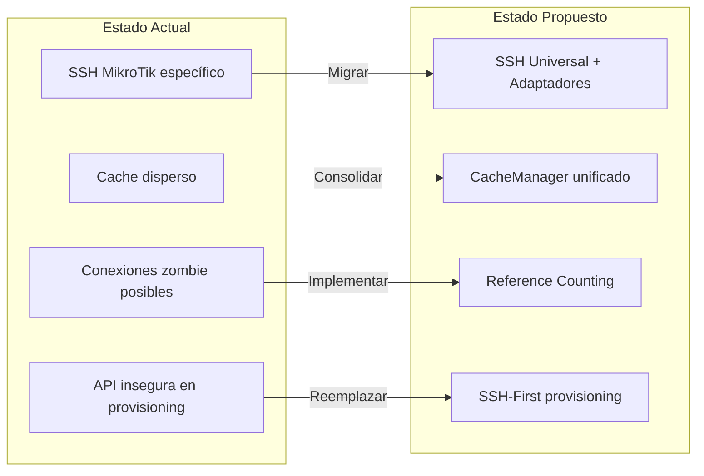
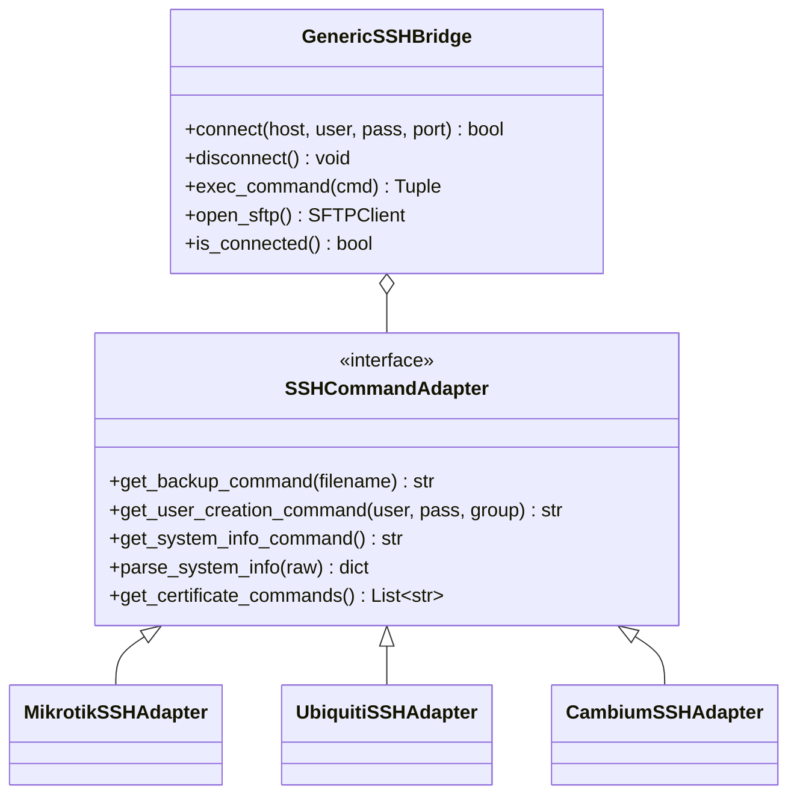
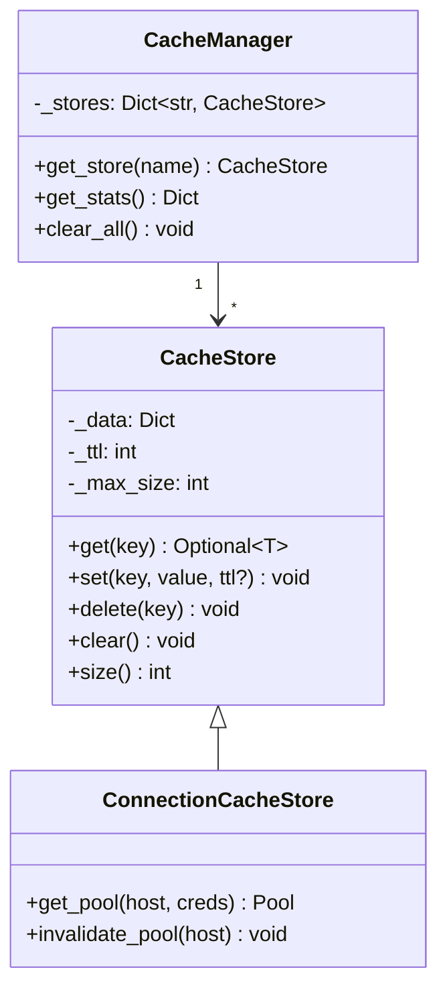
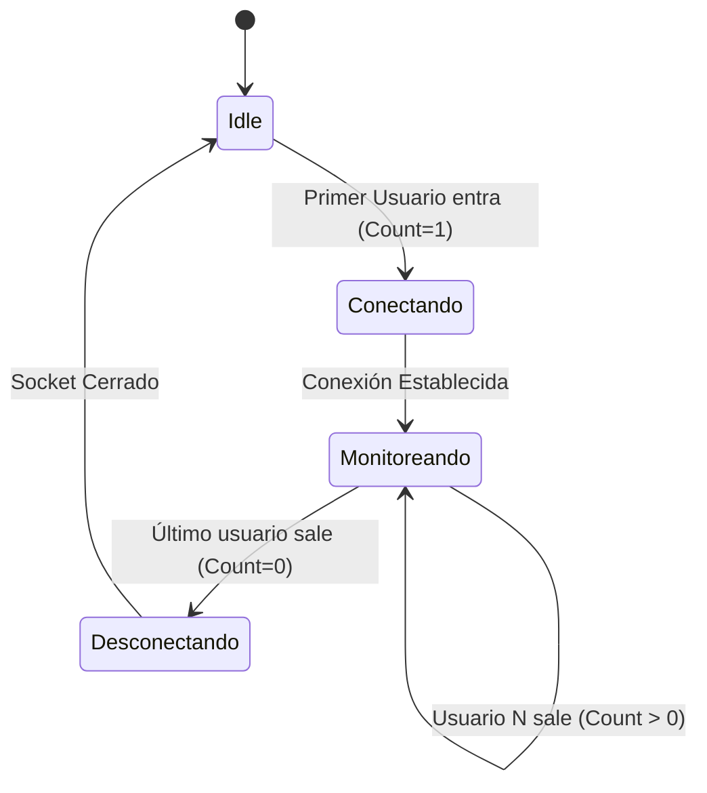
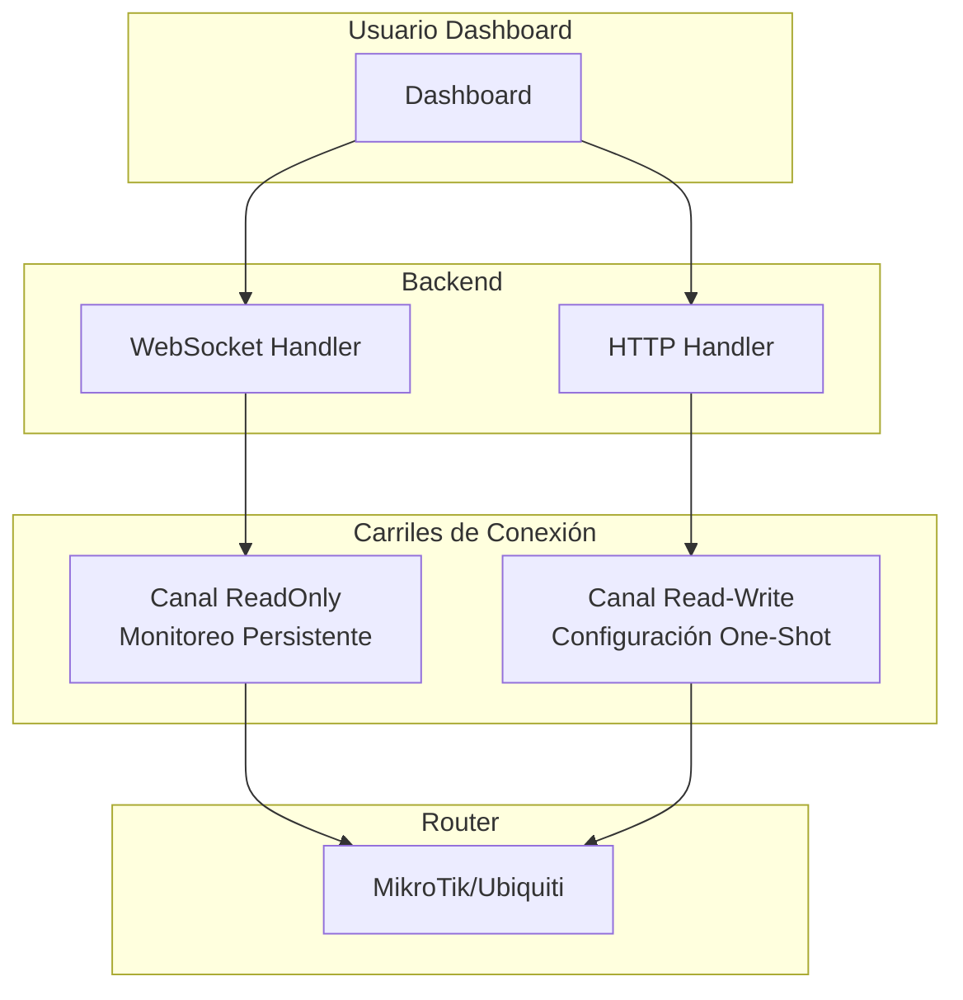
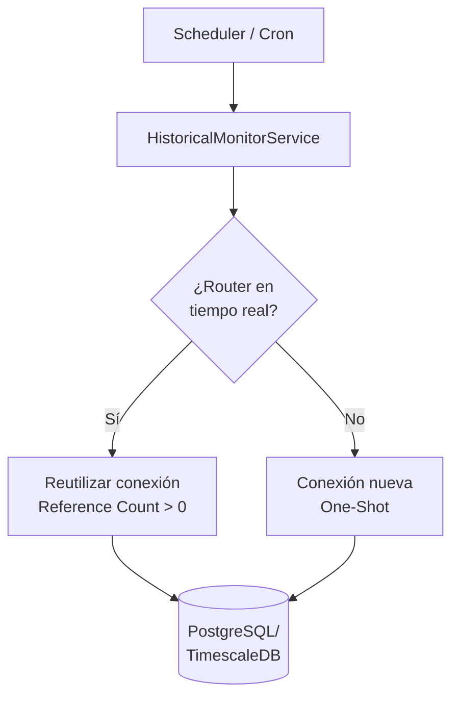
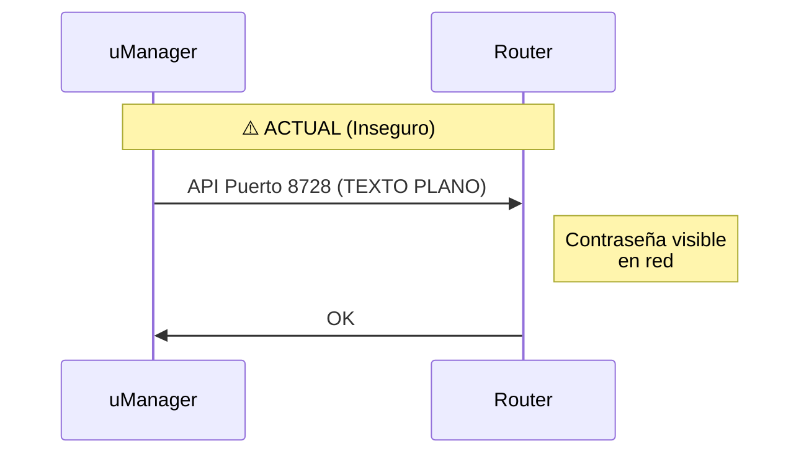
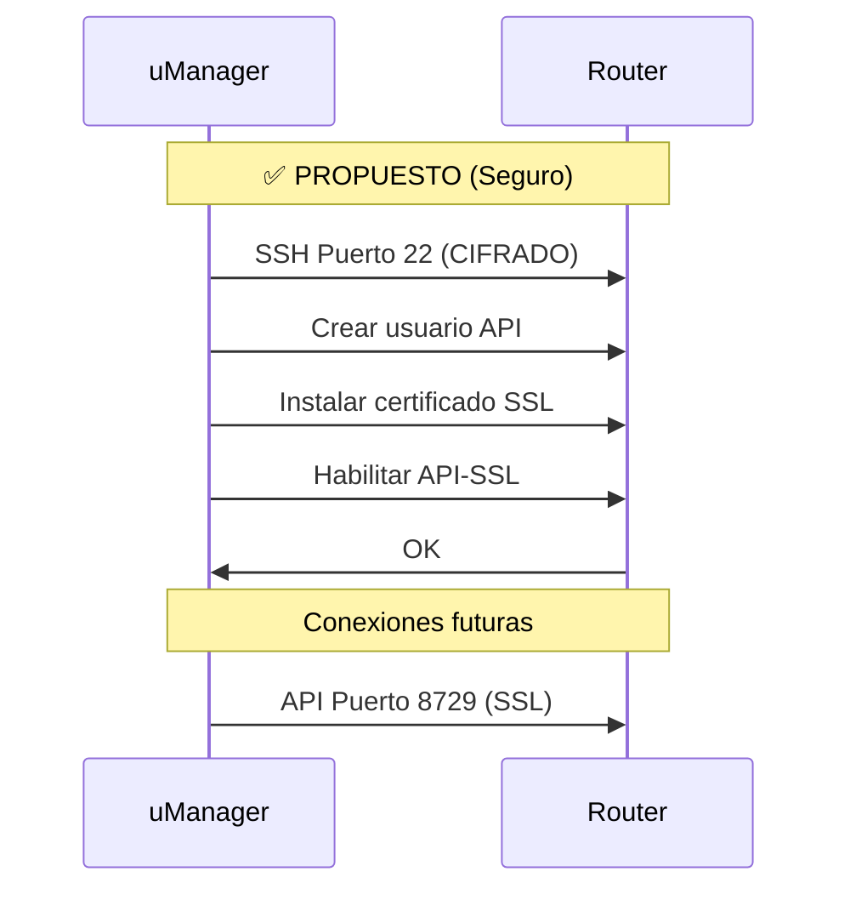
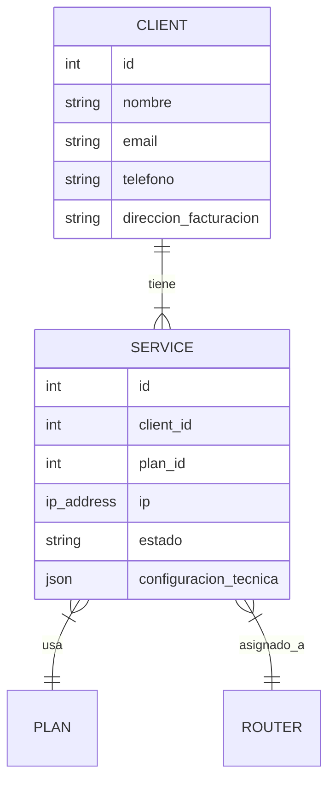
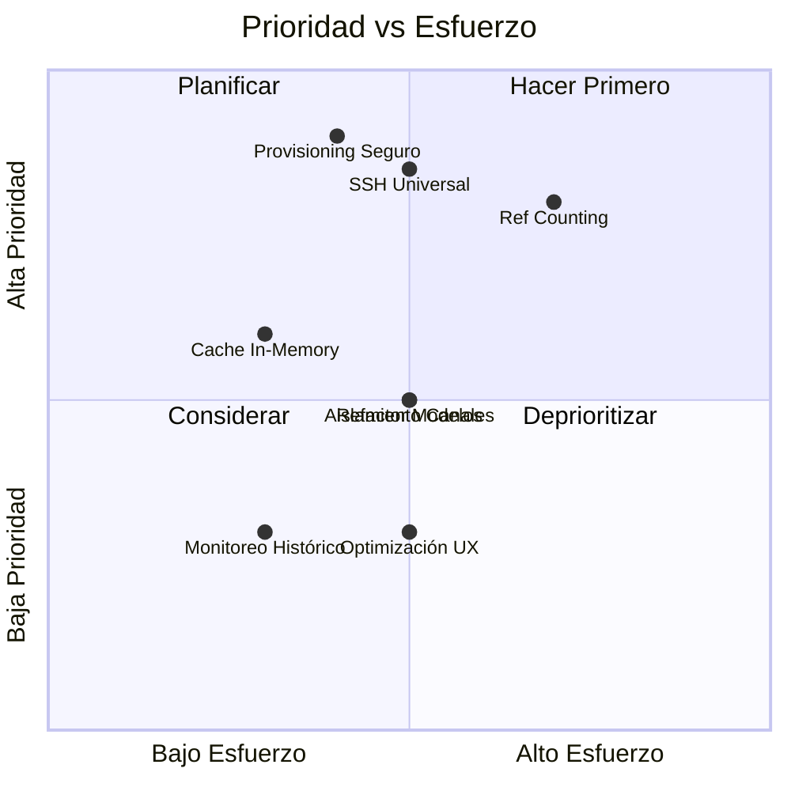

# 📚 Libro de Propuestas de Mejoras - uManager6

**Versión:** 1.0  
**Fecha:** 2025-12-29  
**Estado:** Borrador para Revisión  
**Autores:** Equipo de Desarrollo

---

## 📋 Índice de Contenido

1. [Resumen Ejecutivo](#1-resumen-ejecutivo)
2. [Propuesta 1: Arquitectura SSH Universal con Adaptadores](#2-arquitectura-ssh-universal)
3. [Propuesta 2: Sistema de Cache In-Memory (Sin Redis)](#3-sistema-cache-in-memory)
4. [Propuesta 3: Monitoreo en Tiempo Real con Reference Counting](#4-monitoreo-tiempo-real)
5. [Propuesta 4: Aislamiento de Canales (Lectura vs Escritura)](#5-aislamiento-canales)
6. [Propuesta 5: Monitoreo Histórico Background](#6-monitoreo-historico)
7. [Propuesta 6: Aprovisionamiento Seguro (SSH-First)](#7-aprovisionamiento-seguro)
8. [Propuesta 7: Refactorización de Modelos de Datos](#7-refactorizacion-modelos)
9. [Propuesta 8: Optimización de UX/UI](#8-optimizacion-ux)
10. [Priorización y Roadmap](#9-roadmap)
11. [Anexos Técnicos](#10-anexos)

---

<div style="page-break-after: always;"></div>

# 1. Resumen Ejecutivo

## 🎯 Objetivo del Documento

## 📊 Resumen de Propuestas

| # | Propuesta | Prioridad | Complejidad | Impacto |
|:--|:----------|:----------|:------------|:--------|
| 1 | SSH Universal con Adaptadores | 🔴 Alta | Media | Seguridad + Escalabilidad |
| 2 | Cache In-Memory (Sin Redis) | 🟡 Media | Baja | Rendimiento |
| 3 | Monitoreo Tiempo Real (Ref Counting) | 🔴 Alta | Alta | Eficiencia |
| 4 | Aislamiento de Canales | 🟡 Media | Media | Estabilidad |
| 5 | Monitoreo Histórico Background | 🟢 Baja | Baja | Reportería |
| 6 | Aprovisionamiento Seguro | 🔴 Alta | Media | Seguridad |
| 7 | Refactorización de Modelos | 🟡 Media | Media | Escalabilidad |
| 8 | Optimización UX/UI (HTMX) | 🟢 Baja | Media | Usabilidad |

## 🚦 Estado Actual vs Propuesto



---

<div style="page-break-after: always;"></div>

# 2. Arquitectura SSH Universal con Adaptadores por Marca {#2-arquitectura-ssh-universal}

## 2.1 Problema Actual

Actualmente las conexiones SSH están limitadas a un módulo específico:

```
app/utils/device_clients/mikrotik/ssh_client.py → MikrotikSSHClient
```

**Problemas identificados:**

1. **Acoplamiento Directo:** El código de respaldo y SSL depende de una clase con nombre de marca
2. **Dificultad de Escalamiento:** Para añadir Ubiquiti SSH habría que duplicar lógica Paramiko
3. **Nombre Confuso:** `MikrotikSSHClient` se usa para tareas genéricas de SSH

## 2.2 Solución Propuesta

Separar la lógica de **transporte** (conexión SSH) de la lógica de **comandos** (específica por marca).

### Arquitectura de Clases



### Estructura de Archivos Propuesta

```
app/utils/ssh/
├── __init__.py                 # Exports: get_ssh_adapter, GenericSSHBridge  
├── bridge.py                   # GenericSSHBridge (Paramiko wrapper)
├── factory.py                  # get_ssh_adapter(vendor) -> SSHCommandAdapter
└── adapters/
    ├── __init__.py
    ├── base.py                 # SSHCommandAdapter (ABC)
    ├── mikrotik.py             # MikrotikSSHAdapter  
    ├── ubiquiti.py             # UbiquitiSSHAdapter
    └── cambium.py              # CambiumSSHAdapter (futuro)
```

## 2.3 Ejemplo de Uso

### Sin la nueva arquitectura (actual):
```python
# backup_service.py - Actualmente
from app.utils.device_clients.mikrotik.ssh_client import MikrotikSSHClient

client = MikrotikSSHClient(host, user, password)
client.connect()
client.exec_command('/system backup save name="backup"')
# ¿Qué pasa si es Ubiquiti? Código diferente...
```

### Con la nueva arquitectura:
```python
# backup_service.py - Propuesto
from app.utils.ssh import get_ssh_adapter, GenericSSHBridge

adapter = get_ssh_adapter(vendor="mikrotik")  # o "ubiquiti"
with GenericSSHBridge(host, user, password) as ssh:
    command = adapter.get_backup_command("backup")
    ssh.exec_command(command)
# ¡Funciona para cualquier marca!
```

## 2.4 Alcance de la Migración

> [!IMPORTANT]
> Esta migración es **quirúrgica**. NO tocará lo que ya funciona.

> [!NOTE]
> El SSH Bridge **NO** se usa para monitoreo. El monitoreo continuará usando:
> - **MikroTik:** API-SSL (puerto 8729) - más rápido y estructurado
> - **Ubiquiti:** HTTP/S - funciona bien actualmente
> 
> SSH es solo para tareas de **infraestructura**: backups, provisioning, certificados.

| Módulo | Protocolo Actual | Acción | Justificación |
|:-------|:-----------------|:-------|:--------------|
| Monitor MikroTik | API-SSL | ✅ Sin cambios | Funciona bien |
| Monitor Ubiquiti | HTTP/S | ✅ Sin cambios | "Si no está roto, no lo arregles" |
| Prov. MikroTik | API (Insegura) | 🔄 Migrar a SSH | Cerrar brecha de seguridad |
| Backups Router | SSH (Ad-hoc) | 🔄 Refactorizar | Limpiar código duplicado |

## 2.5 Fases de Implementación

### Fase 1: Crear Infraestructura Base (1-2 días)
- [ ] Crear directorio `app/utils/ssh/`
- [ ] Crear `bridge.py` basado en `MikrotikSSHClient` actual
- [ ] Crear `adapters/base.py` con interfaz abstracta
- [ ] Crear `factory.py`

### Fase 2: Implementar Adaptador MikroTik (1 día)
- [ ] Crear `adapters/mikrotik.py`
- [ ] Mover comandos específicos desde `ssl.py` y `backup_service.py`
- [ ] Tests unitarios

### Fase 3: Migrar Servicios Existentes (2-3 días)
- [ ] Refactorizar `ssl.py` para usar nuevo puente
- [ ] Refactorizar `backup_service.py`
- [ ] Deprecar `mikrotik/ssh_client.py`

### Fase 4: (Futuro) Añadir Nuevas Marcas
- [ ] Crear `adapters/ubiquiti.py` si se necesita SSH
- [ ] Crear `adapters/cambium.py` si se añade soporte

---

<div style="page-break-after: always;"></div>

# 3. Sistema de Cache In-Memory (Sin Redis) {#3-sistema-cache-in-memory}

## 3.1 Estado Actual

Actualmente existen **múltiples sistemas de cache dispersos**:

### Cache de Conexiones MikroTik
```python
# app/utils/device_clients/mikrotik/connection.py
_pool_cache: Dict[tuple, RouterOsApiPool] = {}

def get_pool(host, username, password, port=8729, force_new=False):
    cache_key = (host, port, username)
    if cache_key not in _pool_cache:
        # Crear nueva conexión...
```

### Cache de Clientes Ubiquiti
```python
# app/utils/device_clients/client_provider.py
_client_cache = {}

def get_ubiquiti_client(host, username, password, port=443):
    if host not in _client_cache:
        _client_cache[host] = UbiquitiClient(...)
```

**Problemas:**
1. Lógica duplicada en múltiples archivos
2. Sin control de expiración (TTL)
3. Sin límite de tamaño (puede crecer indefinidamente)
4. Difícil depurar qué hay en cache

## 3.2 Solución Propuesta: CacheManager Unificado

Crear un **gestor de cache centralizado** que no requiera Redis.

### Arquitectura Propuesta



### Código Propuesto

```python
# app/utils/cache/manager.py
from typing import Any, Dict, Optional
from datetime import datetime, timedelta
from threading import RLock
from dataclasses import dataclass, field

@dataclass
class CacheEntry:
    value: Any
    expires_at: Optional[datetime] = None
    created_at: datetime = field(default_factory=datetime.now)

class CacheStore:
    """Cache store sin dependencias externas (sin Redis)."""
    
    def __init__(self, name: str, default_ttl: int = 300, max_size: int = 1000):
        self.name = name
        self.default_ttl = default_ttl  # segundos
        self.max_size = max_size
        self._data: Dict[str, CacheEntry] = {}
        self._lock = RLock()
    
    def get(self, key: str) -> Optional[Any]:
        with self._lock:
            entry = self._data.get(key)
            if entry is None:
                return None
            if entry.expires_at and datetime.now() > entry.expires_at:
                del self._data[key]
                return None
            return entry.value
    
    def set(self, key: str, value: Any, ttl: Optional[int] = None) -> None:
        with self._lock:
            # Evicción LRU si excede max_size
            if len(self._data) >= self.max_size:
                oldest = min(self._data.items(), key=lambda x: x[1].created_at)
                del self._data[oldest[0]]
            
            expires = None
            if ttl or self.default_ttl:
                expires = datetime.now() + timedelta(seconds=ttl or self.default_ttl)
            
            self._data[key] = CacheEntry(value=value, expires_at=expires)
    
    def delete(self, key: str) -> bool:
        with self._lock:
            if key in self._data:
                del self._data[key]
                return True
            return False
    
    def clear(self) -> None:
        with self._lock:
            self._data.clear()
    
    @property
    def size(self) -> int:
        return len(self._data)


class CacheManager:
    """Gestor global de caches."""
    
    _instance = None
    
    def __new__(cls):
        if cls._instance is None:
            cls._instance = super().__new__(cls)
            cls._instance._stores = {}
        return cls._instance
    
    def get_store(self, name: str, **kwargs) -> CacheStore:
        if name not in self._stores:
            self._stores[name] = CacheStore(name=name, **kwargs)
        return self._stores[name]
    
    def get_stats(self) -> Dict[str, int]:
        return {name: store.size for name, store in self._stores.items()}
    
    def clear_all(self) -> None:
        for store in self._stores.values():
            store.clear()


# Singleton global
cache_manager = CacheManager()
```

### Uso Propuesto

```python
# En connection.py
from app.utils.cache import cache_manager

_connection_cache = cache_manager.get_store(
    name="mikrotik_connections",
    default_ttl=3600,  # 1 hora
    max_size=100
)

def get_pool(host, username, password, port=8729):
    cache_key = f"{host}:{port}:{username}"
    
    pool = _connection_cache.get(cache_key)
    if pool is None:
        pool = _create_new_pool(host, username, password, port)
        _connection_cache.set(cache_key, pool)
    
    return pool
```

## 3.3 Beneficios

| Aspecto | Antes | Después |
|:--------|:------|:--------|
| Ubicación | Disperso | Centralizado |
| TTL | ❌ No existe | ✅ Configurable |
| Límite tamaño | ❌ Infinito | ✅ Con evicción LRU |
| Depuración | Difícil | `cache_manager.get_stats()` |
| Redis | No aplica | ✅ No requerido |
| Thread-safe | Parcial | ✅ Completo con RLock |

## 3.4 Estructura de Archivos

```
app/utils/cache/
├── __init__.py          # Export: cache_manager, CacheStore
├── manager.py           # CacheManager, CacheStore
└── stores/
    ├── __init__.py
    └── connection.py    # ConnectionCacheStore especializado
```

## 3.5 Fases de Implementación

### Fase 1: Crear Base (1 día)
- [ ] Crear `app/utils/cache/manager.py`
- [ ] Tests unitarios para CacheStore
- [ ] Tests de thread-safety

### Fase 2: Migrar Caches Existentes (1-2 días)
- [ ] Refactorizar `mikrotik/connection.py`
- [ ] Refactorizar `client_provider.py`
- [ ] Deprecar variables globales `_pool_cache` y `_client_cache`

### Fase 3: (Opcional) Añadir Características
- [ ] Exportar métricas (hits/misses)
- [ ] Endpoint de debug `/api/debug/cache`
- [ ] Limpieza periódica de entradas expiradas

---

<div style="page-break-after: always;"></div>

# 4. Monitoreo en Tiempo Real con Reference Counting {#4-monitoreo-tiempo-real}

## 4.1 Problema Actual

Cuando múltiples usuarios ven el mismo router, el sistema puede:
- Abrir múltiples conexiones SSH/API al mismo dispositivo
- Dejar conexiones "zombie" abiertas si el usuario cierra el navegador
- Consumir recursos innecesarios en el router

## 4.2 Solución: Reference Counting

### Algoritmo Core (Validado)

> [!IMPORTANT]
> **Regla de Oro (Corrección post-V2):** La conexión de monitoreo **NUNCA** debe cerrarse mientras exista al menos **un** suscriptor activo. El cierre debe ser exclusivo cuando `count == 0`.



### Prevención de Zombies

1. **WebSocket Disconnect Event:** FastAPI detecta desconexión TCP y decrementa contador
2. **Garbage Collector:** Proceso de fondo verifica conexiones sin suscriptores cada 10 segundos

## 4.3 Implementación Propuesta

```python
# app/services/monitor_manager.py
from typing import Dict, Set, Callable
import asyncio

class RouterMonitorManager:
    """Gestor de monitoreo con Reference Counting."""
    
    def __init__(self):
        self._subscribers: Dict[str, Set[Callable]] = {}  # host -> callbacks
        self._tasks: Dict[str, asyncio.Task] = {}         # host -> polling task
        self._connections: Dict[str, Any] = {}            # host -> API connection
    
    async def subscribe(self, host: str, callback: Callable) -> None:
        """Suscribir un callback (WebSocket) a un router."""
        if host not in self._subscribers:
            self._subscribers[host] = set()
        
        self._subscribers[host].add(callback)
        
        # Si es el primer suscriptor, iniciar monitoreo
        if len(self._subscribers[host]) == 1:
            await self._start_monitoring(host)
    
    async def unsubscribe(self, host: str, callback: Callable) -> None:
        """Desuscribir un callback de un router."""
        if host in self._subscribers:
            self._subscribers[host].discard(callback)
            
            # Si es el último suscriptor, detener monitoreo
            if len(self._subscribers[host]) == 0:
                await self._stop_monitoring(host)
                del self._subscribers[host]
    
    async def _start_monitoring(self, host: str) -> None:
        """Iniciar polling para un router."""
        # Crear conexión
        self._connections[host] = await self._create_connection(host)
        # Iniciar tarea de polling
        self._tasks[host] = asyncio.create_task(self._polling_loop(host))
    
    async def _stop_monitoring(self, host: str) -> None:
        """Detener polling y cerrar conexión."""
        if host in self._tasks:
            self._tasks[host].cancel()
            del self._tasks[host]
        
        if host in self._connections:
            await self._close_connection(host)
            del self._connections[host]
    
    async def _polling_loop(self, host: str) -> None:
        """Loop de polling cada segundo."""
        while True:
            try:
                data = await self._fetch_data(host)
                await self._broadcast(host, data)
                await asyncio.sleep(1)
            except asyncio.CancelledError:
                break
    
    async def _broadcast(self, host: str, data: dict) -> None:
        """Enviar datos a todos los suscriptores."""
        for callback in self._subscribers.get(host, []):
            try:
                await callback(data)
            except Exception:
                pass  # El callback manejará sus propios errores
```

## 4.4 Comparativa: In-Memory vs Redis

| Característica | In-Memory (Propuesto) | Redis |
|:---------------|:----------------------|:------|
| Infraestructura | ✅ Cero | ❌ Servidor adicional |
| Escalabilidad | ❌ Un solo servidor | ✅ Múltiples workers |
| Latencia | ✅ Mínima (RAM) | 🟡 +ms de red |
| Complejidad | ✅ Baja | ❌ Alta |

> [!TIP]
> La arquitectura propuesta permite migrar a Redis en el futuro de forma transparente, implementando la misma interfaz `MonitorBackend`.

## 4.5 Fases de Implementación

### Fase 1: Crear RouterMonitorManager (2-3 días)
- [ ] Implementar clase base con reference counting
- [ ] Integrar con WebSocket existente
- [ ] Tests de concurrencia

### Fase 2: Migrar WebSocket Actual (1-2 días)
- [ ] Reemplazar lógica actual por Manager
- [ ] Verificar cierre correcto de conexiones

---

<div style="page-break-after: always;"></div>

# 5. Aislamiento de Canales (Lectura vs Escritura) {#5-aislamiento-canales}

## 5.1 El Problema Real (Evidencia en Código)

En `app/utils/device_clients/mikrotik/connection.py` línea 57-63:
```python
# DISABLE POOLING: Always create a fresh connection to avoid thread-safety issues
# caches are causing "Bad file descriptor" and "Malformed sentence" errors
# when mixing WebSocket (long-lived) and HTTP (short-lived) threads.
```

**¿Por qué pasa esto?**
1. WebSocket (monitoreo) mantiene una conexión abierta por minutos
2. HTTP (configuración) intenta usar la misma conexión para enviar un comando
3. Ambos escriben/leen del mismo socket TCP sin coordinación
4. El router responde, pero el mensaje llega al hilo equivocado → "Malformed sentence"

**Solución temporal actual:** `force_new=True` (crear conexión nueva cada vez)  
**Problema:** Desperdicia recursos, no cierra conexiones correctamente y causa latencia.

> [!WARNING]
> **Prioridad Crítica:** El log del sistema muestra errores "Bad file descriptor". Esto confirma que mezclar lecturas (WebSocket) y escrituras (HTTP) en la misma conexión es inviable. La separación de canales es obligatoria.

## 5.2 Solución: Canales Separados



### Carril de Monitoreo (ReadOnly)
- **Propósito:** Lectura continua de CPU, RAM, tráfico
- **Gestión:** Reference Counting (1 conexión por router, compartida entre usuarios)
- **Ciclo de vida:** Se abre cuando el primer usuario entra al dashboard, se cierra cuando el último sale
- **Aislamiento:** Nunca se usa para escribir

### Carril de Configuración (Read-Write)
- **Propósito:** Cambios (VLAN, IP, Firewall, PPPoE)
- **Gestión:** One-Shot (abrir → ejecutar → cerrar inmediatamente)
- **Ciclo de vida:** Cada request HTTP crea su propia conexión
- **Aislamiento:** Sesión completamente independiente

## 5.3 Comparativa

| Característica | Canal Único ❌ | Canales Separados ✅ |
|:---------------|:--------------|:---------------------|
| Fluidez de Datos | Se pausa en escrituras | 100% ininterrumpido |
| Integridad | Riesgo de colisión | Aislamiento total |
| Impacto en Router | 1 Sesión problemática | 2 Sesiones limpias |
| Errores "Bad file descriptor" | Frecuentes | Eliminados |

## 5.4 Implementación Propuesta

### Estructura de Archivos

```
app/utils/device_clients/mikrotik/
├── connection.py          # [MODIFICAR] Separar en dos funciones
├── channels/
│   ├── __init__.py
│   ├── readonly.py        # [NUEVO] Canal de monitoreo persistente
│   └── readwrite.py       # [NUEVO] Canal de configuración one-shot
```

### Código: Canal ReadOnly (Monitoreo)

```python
# app/utils/device_clients/mikrotik/channels/readonly.py
from threading import RLock
from typing import Dict
from routeros_api import RouterOsApiPool

class ReadOnlyChannelManager:
    """Gestiona conexiones de solo lectura para monitoreo."""
    
    def __init__(self):
        self._channels: Dict[str, RouterOsApiPool] = {}
        self._ref_counts: Dict[str, int] = {}
        self._lock = RLock()
    
    def acquire(self, host: str, username: str, password: str, port: int = 8729):
        """Obtiene o crea un canal de lectura. Incrementa ref count."""
        key = f"{host}:{port}"
        
        with self._lock:
            if key not in self._channels:
                self._channels[key] = self._create_pool(host, username, password, port)
                self._ref_counts[key] = 0
            
            self._ref_counts[key] += 1
            return self._channels[key].get_api()
    
    def release(self, host: str, port: int = 8729):
        """Libera referencia. Si llega a 0, cierra la conexión."""
        key = f"{host}:{port}"
        
        with self._lock:
            if key in self._ref_counts:
                self._ref_counts[key] -= 1
                
                if self._ref_counts[key] <= 0:
                    try:
                        self._channels[key].disconnect()
                    except:
                        pass
                    del self._channels[key]
                    del self._ref_counts[key]
    
    def _create_pool(self, host, username, password, port):
        import ssl
        ssl_context = ssl.create_default_context()
        ssl_context.check_hostname = False
        ssl_context.verify_mode = ssl.CERT_NONE
        
        return RouterOsApiPool(
            host, username=username, password=password,
            port=port, use_ssl=True, ssl_context=ssl_context,
            plaintext_login=True
        )

# Singleton global
readonly_channels = ReadOnlyChannelManager()
```

### Código: Canal ReadWrite (Configuración)

```python
# app/utils/device_clients/mikrotik/channels/readwrite.py
import ssl
from routeros_api import RouterOsApiPool
from contextlib import contextmanager

@contextmanager
def get_config_channel(host: str, username: str, password: str, port: int = 8729):
    """
    Context manager para operaciones de escritura.
    Abre conexión, ejecuta, y cierra automáticamente.
    """
    ssl_context = ssl.create_default_context()
    ssl_context.check_hostname = False
    ssl_context.verify_mode = ssl.CERT_NONE
    
    pool = RouterOsApiPool(
        host, username=username, password=password,
        port=port, use_ssl=True, ssl_context=ssl_context,
        plaintext_login=True
    )
    
    try:
        api = pool.get_api()
        yield api
    finally:
        try:
            pool.disconnect()
        except:
            pass
```

### Uso en el Código

**Antes (problemático):**
```python
# Mismo pool para todo
api = mikrotik_connection.get_api(host, user, pass)
api.get_resource("/system/resource").get()  # Lectura
api.get_resource("/interface/vlan").add(...)  # Escritura - COLISIÓN!
```

**Después (aislado):**
```python
# Para monitoreo (WebSocket)
from .channels.readonly import readonly_channels

api = readonly_channels.acquire(host, user, pass)
try:
    while websocket_connected:
        data = api.get_resource("/system/resource").get()
        await websocket.send(data)
finally:
    readonly_channels.release(host)

# Para configuración (HTTP)
from .channels.readwrite import get_config_channel

with get_config_channel(host, user, pass) as api:
    api.get_resource("/interface/vlan").add(name="vlan100", ...)
# Conexión cerrada automáticamente
```

## 5.5 Plan de Migración

### Fase 1: Crear Infraestructura (1 día)
- [ ] Crear directorio `app/utils/device_clients/mikrotik/channels/`
- [ ] Crear `readonly.py` con `ReadOnlyChannelManager`
- [ ] Crear `readwrite.py` con `get_config_channel`

### Fase 2: Migrar WebSocket (1-2 días)
- [ ] Modificar el handler de WebSocket para usar `readonly_channels.acquire/release`
- [ ] Asegurar que `release()` se llame en `finally` o en evento de desconexión

### Fase 3: Migrar HTTP/RouterService (1-2 días)
- [ ] Modificar `MikrotikRouterAdapter` para usar `get_config_channel`
- [ ] Eliminar lógica de `force_new=True` en `connection.py`

### Fase 4: Limpieza
- [ ] Deprecar funciones viejas de `connection.py`
- [ ] Eliminar `_pool_cache` global

## 5.6 Verificación

1. **Abrir dashboard de un router** → Monitoreo funciona fluido
2. **Mientras el dashboard está abierto, aplicar una VLAN** → Dashboard NO se congela
3. **Cerrar dashboard** → Verificar en logs que la conexión ReadOnly se cerró
4. **Revisar logs** → No deben aparecer "Bad file descriptor" ni "Malformed sentence"

---

<div style="page-break-after: always;"></div>

# 6. Monitoreo Histórico Background {#6-monitoreo-historico}

## 6.1 Diferencia con Tiempo Real

| Aspecto | Tiempo Real | Histórico |
|:--------|:------------|:----------|
| Activación | Usuario abre dashboard | Siempre activo |
| Frecuencia | 1 segundo | 5 minutos |
| Persistencia | Volátil (WebSocket) | Base de Datos |
| Propósito | Troubleshooting | Gráficos/Alertas |

## 6.2 Arquitectura



## 6.3 Beneficios

1. **Datos sin Huecos:** Gráficos 24/7 aunque nadie esté viendo
2. **Eficiencia:** Reutiliza conexiones del tiempo real si existen
3. **Alertas Robustas:** Telegram/Email funcionan aunque frontend esté caído

---

<div style="page-break-after: always;"></div>

# 7. Aprovisionamiento Seguro (SSH-First) {#7-aprovisionamiento-seguro}

## 7.1 Problema de Seguridad Actual



## 7.2 Solución Propuesta



## 7.3 Flujo Detallado

1. **Primer Contacto:** SSH con credenciales por defecto
2. **Creación Usuario:** `/user add name=umanager password=... group=full`
3. **Generar CSR:** `/certificate add name=api-ssl`
4. **Importar Cert:** Subir certificado firmado por CA interna
5. **Activar API-SSL:** `/ip service set api-ssl certificate=api-ssl`
6. **Desactivar API:** `/ip service disable api`

---

<div style="page-break-after: always;"></div>


<div style="page-break-after: always;"></div>

# 7. Refactorización de Modelos de Datos {#7-refactorizacion-modelos}

## 7.1 Problema Actual
El modelo `Client` contiene mezclados datos personales (Nombre, Teléfono) con datos del servicio (Plan, IP, Router).

## 7.2 Solución Propuesta
Separar responsabilidades en modelos distintos (Normalización).

### Esquema Propuesto


---

<div style="page-break-after: always;"></div>

# 8. Optimización de UX/UI {#8-optimizacion-ux}

## 8.1 Problema Actual
- Tarjetas de información estáticas.
- Falta de feedback visual en acciones lentas.

## 8.2 Solución Propuesta
1. **Tarjetas de Router con Sparklines:** Gráficos de tráfico en tiempo real en el dashboard.
2. **HTMX para Tablas Dinámicas:** 
   - Implementar **HTMX** para actualizar filas o tablas completas sin recargar la página.
   - Ideal para listas grandes (ej. Interfaces, Logs) manteniendo la simplicidad de Jinja2.
3. **Carga Diferida:** Tablas pesadas cargan asíncronamente vía `hx-get`.
4. **Feedback Unificado:** Toasts y estados de carga (loading spinners).

---

<div style="page-break-after: always;"></div>

# 9. Priorización y Roadmap {#9-roadmap}

## 8.1 Matriz de Priorización



## 8.2 Roadmap Propuesto

### Sprint 1: Seguridad (Semana 1-2)
- [x] SSH Universal Base
- [ ] Aprovisionamiento Seguro MikroTik
- [ ] Tests de integración

### Sprint 2: Rendimiento (Semana 3-4)
- [ ] CacheManager In-Memory
- [ ] Migrar caches existentes
- [ ] Reference Counting para WebSocket

### Sprint 3: Estabilidad (Semana 5-6)
- [ ] Aislamiento de Canales
- [ ] Garbage Collector de conexiones
- [ ] Monitoreo histórico básico
- [ ] Refactorización de Modelos (Client/Service)

### Sprint 4: Expansión (Futuro)
- [ ] Adaptador SSH Ubiquiti
- [ ] Adaptador SSH Cambium
- [ ] Métricas y alertas avanzadas
- [ ] Optimización UX/UI (Sparklines)

---

<div style="page-break-after: always;"></div>

# 10. Anexos Técnicos {#10-anexos}

## 9.1 Código Base Existente

### MikrotikSSHClient Actual
Ubicación: `app/utils/device_clients/mikrotik/ssh_client.py`

Métodos disponibles:
- `connect()` → bool
- `disconnect()` → void
- `exec_command(cmd)` → Tuple[stdin, stdout, stderr]
- `open_sftp()` → SFTPClient
- `is_connected()` → bool

### Connection Pool Actual
Ubicación: `app/utils/device_clients/mikrotik/connection.py`

Variables globales:
- `_pool_cache: Dict[tuple, RouterOsApiPool]`

Funciones:
- `get_pool(host, user, pass, port)` → RouterOsApiPool
- `get_api(host, user, pass, port)` → RouterOsApi
- `remove_pool(host)` → void
- `clear_all_pools()` → void


|

## 9.2 Glosario
| Término | Definición |
|:--------|:-----------|
| **Reference Counting** | Técnica para contar usuarios activos y cerrar recursos cuando Count=0 |
| **One-Shot** | Conexión que se abre, ejecuta un comando, y cierra inmediatamente |
| **Adapter Pattern** | Patrón de diseño que separa interfaz de implementación |
| **TTL** | Time To Live - tiempo antes de expirar una entrada de cache |
| **LRU** | Least Recently Used - estrategia de evicción de cache |
| **SSH-First** | Estrategia de usar SSH como protocolo inicial seguro |

---

**Fin del Documento**

*Última actualización: 2025-12-29*
