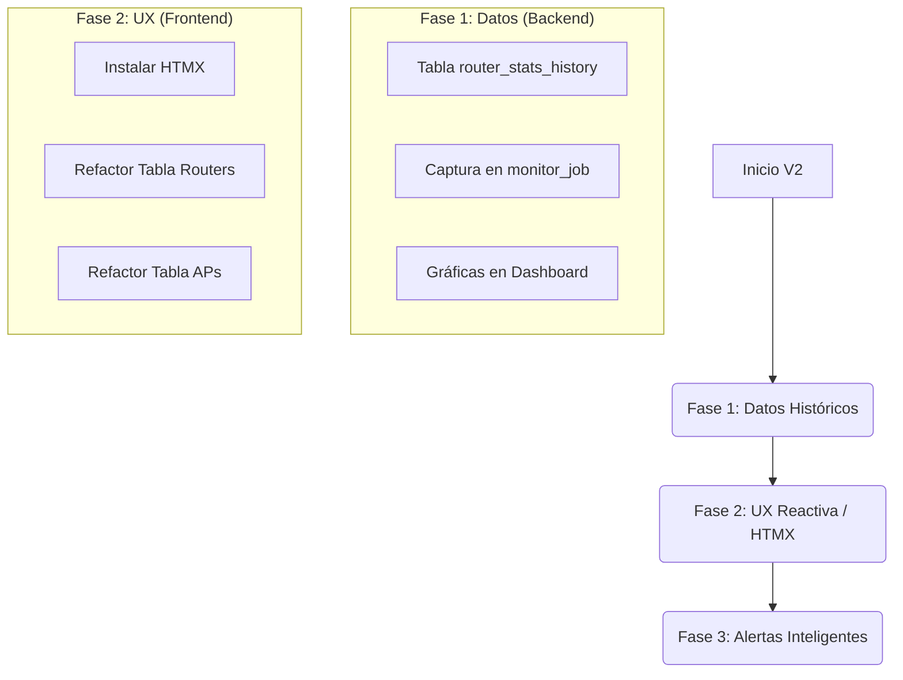

# 📚 Libro de Propuestas de Mejoras - uManager6 (V2)

**Versión:** 2.0  
**Fecha:** 2026-01-04  
**Estado:** Vivo / En Implementación  
**Base:** [V1 (2025-12-29)](./LIBRO_PROPUESTAS_MEJORAS_V1.md)

---

## 📋 Resumen Ejecutivo V2

Tras el sprint de estabilización inicial, el núcleo ("Core") del sistema ha alcanzado un nivel de madurez alto. Los problemas críticos de bloqueos ("Freezes") y conexiones zombies han sido resueltos. 

Esta versión V2 se centra en **completar la paridad de funcionalidades** (Histórico Routers) y **modernizar la experiencia de usuario** (UX).

### 🚦 Semáforo de Estado (v1 -> v2)

| Módulo | Propuesta V1 | Estado Actual | Acción V2 |
|:---|:---|:---|:---|
| **Core Connection** | Aislamiento Canales + Ref. Counting | ✅ **COMPLETADO** | Mantenimiento |
| **Rendimiento** | Cache In-Memory | ✅ **COMPLETADO** | Mantenimiento |
| **Modelos** | Refactor Cliente/Servicio | ✅ **COMPLETADO** | Expandir si es necesario |
| **Monitoreo** | Tiempo Real (WebSockets) | ✅ **COMPLETADO** | Optimizar |
| **Histórico** | Routers & APs Background | 🟡 **PARCIAL** | **PRIORIDAD ALTA** |
| **UX/UI** | HTMX / Dinámico | 🔴 **PENDIENTE** | **PRIORIDAD MEDIA** |
| **Seguridad** | Provisioning (SSH-First) | 🟡 **ADAPTADO** | Aceptado como está (Vía API) |
| **Infraestructura** | SSH Universal | 🔴 **PENDIENTE** | Baja Prioridad (Deuda Técnica) |

---

## 1. 🥇 Prioridad Alta: Completar Monitoreo Histórico {#1-monitoreo-historico}

### 1.1 Situación Actual
- **APs:** ✅ Guardan histórico completo en `ap_stats_history` y `cpe_stats_history`.
- **Routers:** ❌ Solo se guarda el "último estado" en `routers` (`last_status`, `model`, etc.). No hay gráficas de CPU/Tráfico históricas.

### 1.2 Implementación Requerida
Necesitamos nivelar los Routers para que tengan su propia tabla de histórico, permitiendo gráficas de "Consumo 24h" en el dashboard.

**Plan de Acción:**
1.  **Crear Tabla:** `router_stats_history` en `stats.sqlite`.
    *   Columnas: `timestamp`, `host`, `cpu_load`, `free_memory`, `uptime`, `voltage`, `temperature`.
2.  **Actualizar `stats_db.py`:** Crear función `save_router_stats()`.
3.  **Actualizar `monitor_job.py`:** Llamar a `save_router_stats` en cada ciclo (cada 5 min).

### 1.3 Beneficio
Permitirá a los técnicos ver si un corte de servicio coincidió con un pico de CPU o una caída de voltaje en el nodo.

---

## 2. 🥈 Prioridad Media: Modernización UX/UI (HTMX) {#2-ux-ui-htmx}

### 2.1 El Problema
El sistema actual es **robusto pero estático**.
- Para ver si un router volvió en línea, hay que recargar la página (`F5`).
- Las tablas grandes (Logs, Clientes) hacen lenta la carga inicial.

### 2.2 La Solución: "Islas de Dinamismo"
No vamos a reescribir todo en React/Vue. Usaremos **HTMX** para inyectar vida en templates Jinja2 existentes.

**Puntos de Integración Clave:**
1.  **Tablas de Estado (Routers/APs):** Usar `hx-get="/partials/routers/status"` con `hx-trigger="every 5s"` para actualizar solo las celdas de estado (Online/Offline) sin parpadeos.
2.  **Búsqueda de Clientes:** Implementar "Active Search" (búsqueda mientras escribes) en la lista de clientes.
3.  **Logs en Tiempo Real:** Cargar los últimos logs automáticamente en el Dashboard principal.

---

## 3. 🥉 Mantenimiento y Deuda Técnica {#3-mantenimiento}

### 3.1 SSH Universal (Baja Prioridad)
La propuesta V1 de unificar todo bajo una clase `GenericSSHBridge` es válida arquitecturalmente, pero **arriesgada** de implementar ahora que el sistema es estable.
*   **Decisión:** Posponer indefinidamente. Solo refactorizar si se necesita agregar una tercera marca de routers (ej. Huawei/Cisco).

### 3.2 Aprovisionamiento Seguro
Actualmente usamos la API estándar (puerto 8728) para el primer contacto y luego activamos SSL.
*   **Decisión:** Es suficientemente seguro para redes de gestión internas (VLAN de gestión). No requiere cambios inmediatos.

---

## 4. Roadmap Sugerido V2

### Próximos Pasos Inmediatos (Quick Wins)
1.  Ejecutar migración de DB para `router_stats_history`.
2.  Modificar `monitor_job.py` para empezar a recolectar datos HOY.

---
**Fin del Documento V2**
