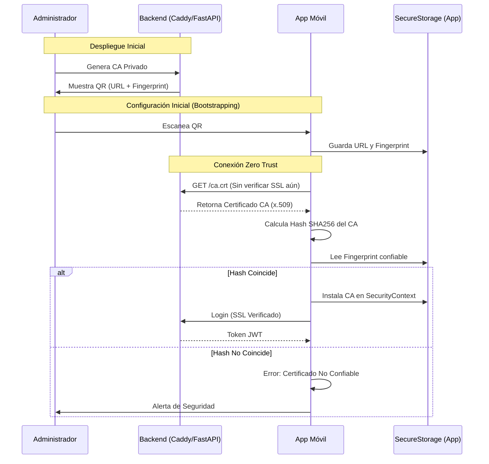

# Arquitectura Zero Trust para Certificados CA en µMonitor Pro

Este documento describe la arquitectura propuesta para el manejo seguro de certificados CA ("Hybrid Zero Trust") en la aplicación móvil y el backend.

## Problemática

Cada despliegue de µMonitor Pro (cada cliente/instancia) puede tener su propia Autoridad Certificadora (CA) privada (ej: generada por Caddy).
La aplicación móvil debe ser capaz de conectarse de forma segura a **cualquier** instancia legítima sin confiar ciegamente en CAs desconocidas y sin requerir reconstruir la app para cada cliente.

## Solución: Trust Anchor Dinámico "Bootstrap"

En lugar de "quemar" el certificado o su fingerprint en el código de la app (lo cual la "casaría" con una sola instancia), la app debe permitir **importar** el Trust Anchor (la huella digital de confianza) en el momento de la configuración inicial.

### Flujo de Vinculación (Bootstrapping)

1.  **Backend (Servidor)**:
    -   Expone un endpoint público (pero seguro) o una interfaz administrativa que muestra un **Código QR**.
    -   Este QR contiene:
        -   URL del API: `https://mi-servidor.com:8000`
        -   Fingerprint del CA (Trust Anchor): `SHA256:7A:BC:...`

2.  **App Móvil (Cliente)**:
    -   En la pantalla de Login, el usuario selecciona "Configurar Servidor".
    -   La app ofrece dos métodos de configuración:

    #### Método A: Escaneo de QR (Rápido)
    -   El usuario selecciona "Escanear QR".
    -   La cámara lee el JSON con URL y Fingerprint.
    -   Ideal para configuración inicial en sitio.

    #### Método B: Entrada Manual (Respaldo)
    -   El usuario ingresa manualmente:
        1.  **URL Base**: `https://...`
        2.  **Fingerprint**: El hash SHA256 (puede copiar/pegar si se envió por mensajería segura).
    -   Ideal para soporte remoto o si la cámara falla.

    -   La app guarda estos datos en almacenamiento seguro local (`SecureStorage`).

3.  **Conexión Segura (Handshake "Bootstrap")**:
    -   *Crucial*: La app realiza una petición GET a `https://mi-servidor.com/static/ca.crt`.
    -   **Nota Técnica**: Como la app aún no confía en el CA, esta petición específica debe hacerse ignorando errores de SSL (`BadCertificateCallback` que retorna `true` o `HttpClient` inseguro temporal).
    -   La app descarga el archivo `.crt` y calcula su HASH SHA256 localmente.
    -   **Verificación**: Si `HASH_CALCULADO == FINGERPRINT_GUARDADO`:
        -   El archivo es legítimo.
        -   Se instala el certificado en el `SecurityContext` de la app.
        -   A partir de este momento, todas las conexiones al API usan SSL verificando contra este CA.
    -   Si no coinciden: Se descarta el archivo y se lanza error de seguridad (Posible ataque MITM).

### Diagrama de Arquitectura



## Requerimientos para el Backend

Para soportar este flujo, el backend debe:

1.  **Exponer el CA**: Servir el archivo `root.crt` (el certificado público de la CA) en una ruta URL accesible sin autenticación, por ejemplo: `GET /static/ca.crt`.
    -   *En Caddy:* Esto suele estar en `~/.local/share/caddy/pki/authorities/local/root.crt`.
    -   Se puede montar como volumen estático.

2.  **(Opcional) Generar QR**: Un endpoint administrativo o script CLI que genere el QR con el siguiente **Contrato Estricto JSON**:
    ```json
    {
      "server_url": "https://192.168.1.50:8000",
      "ca_sha256": "7A:BC:DE:F0:..." // Hexadecimal uppercase, con o sin colons
    }
    ```

### Ejemplo de Configuración Caddy

Para exponer el certificado de forma segura sin exponer todo el sistema:

```caddyfile
:8000 {
    # Configuración TLS interna automática
    tls internal

    # API Proxy
    reverse_proxy /api/* localhost:8080

    # Exponer CA públicamente para bootstrapping
    handle /static/ca.crt {
        # Ruta típica de Caddy en Linux para la autoridad local
        root * /var/lib/caddy/.local/share/caddy/pki/authorities/local/
        try_files root.crt
        file_server
    }
}
```

## Ciclo de Vida y Mantenimiento

1.  **Expiración del Certificado**:
    -   Los certificados CA privados eventualmente expiran.
    -   Cuando esto ocurra, la app dejará de conectar.
    -   **Solución**: El administrador debe regenerar el CA y los usuarios deben volver a escanear el nuevo QR.
    -   *Recomendación*: Configurar los CA con una vida útil larga (ej. 10 años) para minimizar disrupciones.

2.  **Seguridad del QR**:
    -   El QR es la "llave maestra" de la confianza.
    -   No debe enviarse por canales inseguros (email sin cifrar).
    -   Idealmente debe ser escaneado directamente de la pantalla del administrador.

## Ventajas

1.  **Universalidad**: Una sola APK sirve para cualquier cliente.
2.  **Seguridad**: No se confía en la red ("Zero Trust"). Incluso si alguien intercepta la descarga del CA, si el fingerprint no coincide, la app no conectará.
3.  **Independencia**: Cada despliegue es soberano de su propia seguridad PKI.
4.  **UX**: El usuario final no tiene que instalar certificados en la configuración profunda de Android/iOS. Todo ocurre "in-app".

## Conclusión

Esta arquitectura desacopla el binario de la aplicación (el APK) de la infraestructura específica (el CA del servidor), manteniendo un nivel de seguridad extremadamente alto mediante el intercambio seguro del Trust Anchor (el QR inicial).
